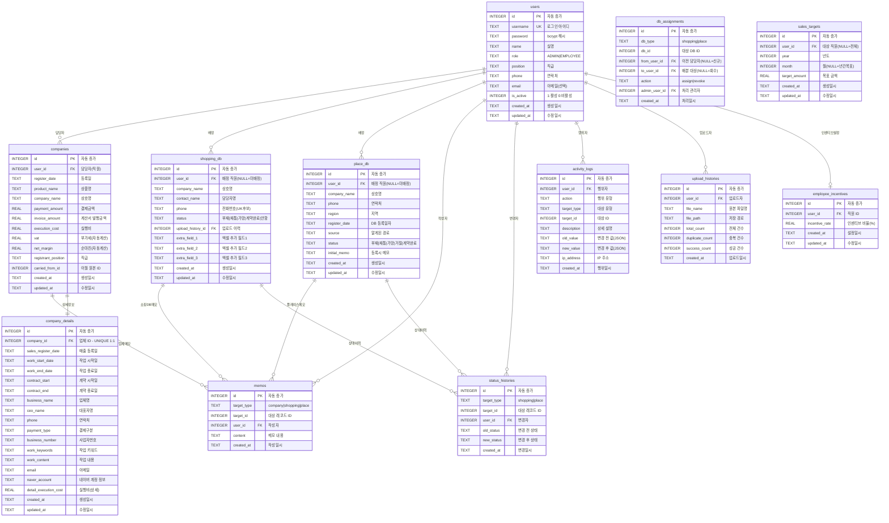

# ERP + CRM 통합 시스템 ERD 및 ORM 스키마

> **문서 버전**: v1.1
> **작성일**: 2026-03-05
> **데이터베이스**: SQLite3
> **ORM**: 순수 PHP 커스텀 ORM (Composer 미사용)

---

## 1. ERD (Entity Relationship Diagram) - Mermaid 문법



---

## 2. 테이블 상세 정의

### 2.1 users (사용자)

| 컬럼명 | 타입 | 제약조건 | 기본값 | 설명 |
|--------|------|----------|--------|------|
| id | INTEGER | PK, AUTO INCREMENT | - | 사용자 고유 ID |
| username | TEXT | NOT NULL, UNIQUE | - | 로그인 아이디 |
| password | TEXT | NOT NULL | - | bcrypt 해시 비밀번호 |
| name | TEXT | NOT NULL | - | 실명 |
| role | TEXT | NOT NULL, CHECK(role IN ('ADMIN','EMPLOYEE')) | 'EMPLOYEE' | 역할 |
| position | TEXT | NULL | NULL | 직급 |
| phone | TEXT | NULL | NULL | 연락처 |
| email | TEXT | NULL | NULL | 이메일 |
| is_active | INTEGER | NOT NULL, CHECK(is_active IN (0,1)) | 1 | 활성화 상태 |
| created_at | TEXT | NOT NULL | CURRENT_TIMESTAMP | 생성일시 |
| updated_at | TEXT | NOT NULL | CURRENT_TIMESTAMP | 수정일시 |

**인덱스:**
- `idx_users_username` UNIQUE ON (username)
- `idx_users_role` ON (role)
- `idx_users_is_active` ON (is_active)

---

### 2.2 companies (업체 - ERP 매출)

| 컬럼명 | 타입 | 제약조건 | 기본값 | 설명 |
|--------|------|----------|--------|------|
| id | INTEGER | PK, AUTO INCREMENT | - | 업체 고유 ID |
| user_id | INTEGER | FK → users(id) | NULL | 담당 직원 |
| register_date | TEXT | NOT NULL | - | 등록일 (YYYY-MM-DD) |
| product_name | TEXT | NOT NULL | - | 상품명 |
| company_name | TEXT | NOT NULL | - | 상호명 |
| payment_amount | REAL | NOT NULL | 0 | 결제금액 |
| invoice_amount | REAL | NULL | 0 | 계산서 발행금액 |
| execution_cost | REAL | NOT NULL | 0 | 실행비 |
| vat | REAL | NOT NULL | 0 | 부가세 (자동: payment_amount / 11) |
| net_margin | REAL | NOT NULL | 0 | 순마진 (자동: payment - execution - vat) |
| registrant_position | TEXT | NULL | NULL | 직급 |
| carried_from_id | INTEGER | FK → companies(id) | NULL | 이월 원본 ID |
| is_active | INTEGER | NOT NULL | 1 | 활성 상태 |
| created_at | TEXT | NOT NULL | CURRENT_TIMESTAMP | 생성일시 |
| updated_at | TEXT | NOT NULL | CURRENT_TIMESTAMP | 수정일시 |

**인덱스:**
- `idx_companies_user_id` ON (user_id)
- `idx_companies_register_date` ON (register_date)
- `idx_companies_company_name` ON (company_name)
- `idx_companies_created_at` ON (created_at)

**트리거:**
```sql
-- 순마진 자동 계산 트리거 (INSERT)
CREATE TRIGGER trg_companies_calc_insert
AFTER INSERT ON companies
BEGIN
    UPDATE companies
    SET vat = ROUND(NEW.payment_amount / 11, 0),
        net_margin = NEW.payment_amount - NEW.execution_cost - ROUND(NEW.payment_amount / 11, 0)
    WHERE id = NEW.id;
END;

-- 순마진 자동 계산 트리거 (UPDATE)
CREATE TRIGGER trg_companies_calc_update
AFTER UPDATE OF payment_amount, execution_cost ON companies
BEGIN
    UPDATE companies
    SET vat = ROUND(NEW.payment_amount / 11, 0),
        net_margin = NEW.payment_amount - NEW.execution_cost - ROUND(NEW.payment_amount / 11, 0),
        updated_at = datetime('now', 'localtime')
    WHERE id = NEW.id;
END;
```

---

### 2.3 company_details (업체 상세)

| 컬럼명 | 타입 | 제약조건 | 기본값 | 설명 |
|--------|------|----------|--------|------|
| id | INTEGER | PK, AUTO INCREMENT | - | 상세 고유 ID |
| company_id | INTEGER | FK → companies(id), UNIQUE | - | 업체 ID (1:1) |
| sales_register_date | TEXT | NULL | NULL | 매출 등록일 |
| work_start_date | TEXT | NULL | NULL | 작업 시작일 |
| work_end_date | TEXT | NULL | NULL | 작업 종료일 |
| contract_start | TEXT | NULL | NULL | 계약 시작일 |
| contract_end | TEXT | NULL | NULL | 계약 종료일 |
| business_name | TEXT | NULL | NULL | 업체명 |
| ceo_name | TEXT | NULL | NULL | 대표자명 |
| phone | TEXT | NULL | NULL | 연락처 |
| payment_type | TEXT | NULL | NULL | 결제구분 |
| business_number | TEXT | NULL | NULL | 사업자번호 |
| work_keywords | TEXT | NULL | NULL | 작업 키워드 |
| work_content | TEXT | NULL | NULL | 작업 내용 |
| email | TEXT | NULL | NULL | 이메일 |
| naver_account | TEXT | NULL | NULL | 네이버 계정 정보 |
| detail_execution_cost | REAL | NULL | 0 | 실행비 (상세) |
| created_at | TEXT | NOT NULL | CURRENT_TIMESTAMP | 생성일시 |
| updated_at | TEXT | NOT NULL | CURRENT_TIMESTAMP | 수정일시 |

**인덱스:**
- `idx_company_details_company_id` UNIQUE ON (company_id)
- `idx_company_details_business_number` ON (business_number)
- `idx_company_details_ceo_name` ON (ceo_name)

---

### 2.4 shopping_db (네이버 쇼핑 DB)

| 컬럼명 | 타입 | 제약조건 | 기본값 | 설명 |
|--------|------|----------|--------|------|
| id | INTEGER | PK, AUTO INCREMENT | - | 쇼핑 DB 고유 ID |
| user_id | INTEGER | FK → users(id) | NULL | 배정 직원 (NULL=미배정) |
| company_name | TEXT | NULL | NULL | 상호명 |
| contact_name | TEXT | NULL | NULL | 담당자명 |
| phone | TEXT | NOT NULL | - | 전화번호 |
| status | TEXT | NOT NULL, CHECK | '안함' | 상태값 |
| upload_history_id | INTEGER | FK → upload_histories(id) | NULL | 업로드 이력 ID |
| extra_field_1 | TEXT | NULL | NULL | 엑셀 추가필드 1 |
| extra_field_2 | TEXT | NULL | NULL | 엑셀 추가필드 2 |
| extra_field_3 | TEXT | NULL | NULL | 엑셀 추가필드 3 |
| created_at | TEXT | NOT NULL | CURRENT_TIMESTAMP | 생성일시 |
| updated_at | TEXT | NOT NULL | CURRENT_TIMESTAMP | 수정일시 |

**상태값 CHECK 제약:**
```sql
CHECK(status IN ('부재', '재통', '가망', '계약완료', '안함'))
```

**인덱스:**
- `idx_shopping_user_id` ON (user_id)
- `idx_shopping_phone` ON (phone)
- `idx_shopping_status` ON (status)
- `idx_shopping_created_at` ON (created_at)
- `idx_shopping_company_name` ON (company_name)

---

### 2.5 place_db (네이버 플레이스 DB)

| 컬럼명 | 타입 | 제약조건 | 기본값 | 설명 |
|--------|------|----------|--------|------|
| id | INTEGER | PK, AUTO INCREMENT | - | 플레이스 DB 고유 ID |
| user_id | INTEGER | FK → users(id) | NULL | 배정 직원 (NULL=미배정) |
| company_name | TEXT | NOT NULL | - | 상호명 |
| phone | TEXT | NOT NULL | - | 연락처 |
| region | TEXT | NULL | NULL | 지역 |
| register_date | TEXT | NOT NULL | - | DB 등록일자 |
| source | TEXT | NULL | NULL | 알게된 경로 |
| status | TEXT | NOT NULL, CHECK | '부재' | 상태값 |
| initial_memo | TEXT | NULL | NULL | 등록시 메모 |
| created_at | TEXT | NOT NULL | CURRENT_TIMESTAMP | 생성일시 |
| updated_at | TEXT | NOT NULL | CURRENT_TIMESTAMP | 수정일시 |

**상태값 CHECK 제약:**
```sql
CHECK(status IN ('부재', '재통', '가망', '거절', '계약완료'))
```

**인덱스:**
- `idx_place_user_id` ON (user_id)
- `idx_place_phone` ON (phone)
- `idx_place_status` ON (status)
- `idx_place_region` ON (region)
- `idx_place_register_date` ON (register_date)
- `idx_place_company_name` ON (company_name)

---

### 2.6 memos (메모 - 공통)

| 컬럼명 | 타입 | 제약조건 | 기본값 | 설명 |
|--------|------|----------|--------|------|
| id | INTEGER | PK, AUTO INCREMENT | - | 메모 고유 ID |
| target_type | TEXT | NOT NULL, CHECK | - | 대상 유형 |
| target_id | INTEGER | NOT NULL | - | 대상 레코드 ID |
| user_id | INTEGER | FK → users(id), NOT NULL | - | 작성자 |
| content | TEXT | NOT NULL | - | 메모 내용 |
| created_at | TEXT | NOT NULL | CURRENT_TIMESTAMP | 작성일시 |

**target_type CHECK 제약:**
```sql
CHECK(target_type IN ('company', 'shopping', 'place'))
```

**인덱스:**
- `idx_memos_target` ON (target_type, target_id)
- `idx_memos_user_id` ON (user_id)
- `idx_memos_created_at` ON (created_at)

**참고:** 메모는 INSERT ONLY. UPDATE/DELETE 불가 정책 (히스토리 누적).

---

### 2.7 status_histories (상태 변경 히스토리)

| 컬럼명 | 타입 | 제약조건 | 기본값 | 설명 |
|--------|------|----------|--------|------|
| id | INTEGER | PK, AUTO INCREMENT | - | 히스토리 고유 ID |
| target_type | TEXT | NOT NULL, CHECK | - | 대상 유형 |
| target_id | INTEGER | NOT NULL | - | 대상 레코드 ID |
| user_id | INTEGER | FK → users(id), NOT NULL | - | 변경자 |
| old_status | TEXT | NULL | NULL | 변경 전 상태 |
| new_status | TEXT | NOT NULL | - | 변경 후 상태 |
| created_at | TEXT | NOT NULL | CURRENT_TIMESTAMP | 변경일시 |

**target_type CHECK 제약:**
```sql
CHECK(target_type IN ('shopping', 'place'))
```

**인덱스:**
- `idx_status_hist_target` ON (target_type, target_id)
- `idx_status_hist_user_id` ON (user_id)
- `idx_status_hist_created_at` ON (created_at)

---

### 2.8 upload_histories (엑셀 업로드 이력)

| 컬럼명 | 타입 | 제약조건 | 기본값 | 설명 |
|--------|------|----------|--------|------|
| id | INTEGER | PK, AUTO INCREMENT | - | 업로드 이력 ID |
| user_id | INTEGER | FK → users(id), NOT NULL | - | 업로드자 |
| file_name | TEXT | NOT NULL | - | 원본 파일명 |
| file_path | TEXT | NULL | NULL | 서버 저장 경로 |
| total_count | INTEGER | NOT NULL | 0 | 전체 건수 |
| duplicate_count | INTEGER | NOT NULL | 0 | 중복 건수 |
| success_count | INTEGER | NOT NULL | 0 | 성공 건수 |
| created_at | TEXT | NOT NULL | CURRENT_TIMESTAMP | 업로드일시 |

**인덱스:**
- `idx_upload_hist_user_id` ON (user_id)
- `idx_upload_hist_created_at` ON (created_at)

---

### 2.9 activity_logs (활동 로그)

| 컬럼명 | 타입 | 제약조건 | 기본값 | 설명 |
|--------|------|----------|--------|------|
| id | INTEGER | PK, AUTO INCREMENT | - | 로그 고유 ID |
| user_id | INTEGER | FK → users(id) | NULL | 행위자 (NULL=시스템) |
| action | TEXT | NOT NULL | - | 행위 유형 |
| target_type | TEXT | NULL | NULL | 대상 유형 |
| target_id | INTEGER | NULL | NULL | 대상 ID |
| description | TEXT | NULL | NULL | 상세 설명 |
| old_value | TEXT | NULL | NULL | 변경 전 값 (JSON) |
| new_value | TEXT | NULL | NULL | 변경 후 값 (JSON) |
| ip_address | TEXT | NULL | NULL | IP 주소 |
| created_at | TEXT | NOT NULL | CURRENT_TIMESTAMP | 행위일시 |

**action 타입 정의:**
| action 값 | 설명 |
|-----------|------|
| LOGIN | 로그인 |
| LOGOUT | 로그아웃 |
| USER_CREATE | 직원 계정 생성 |
| USER_UPDATE | 직원 계정 수정 |
| USER_DELETE | 직원 계정 비활성화 |
| COMPANY_CREATE | 업체 등록 |
| COMPANY_UPDATE | 업체 수정 |
| COMPANY_CARRYOVER | 업체 이월 |
| SHOPPING_UPLOAD | 쇼핑 DB 업로드 |
| SHOPPING_STATUS | 쇼핑 DB 상태 변경 |
| SHOPPING_ASSIGN | 쇼핑 DB 배분 |
| SHOPPING_REVOKE | 쇼핑 DB 회수 |
| PLACE_CREATE | 플레이스 DB 등록 |
| PLACE_STATUS | 플레이스 DB 상태 변경 |
| PLACE_ASSIGN | 플레이스 DB 배분 |
| PLACE_REVOKE | 플레이스 DB 회수 |
| MEMO_CREATE | 메모 작성 |
| EXCEL_DOWNLOAD | 엑셀 다운로드 |

**인덱스:**
- `idx_activity_user_id` ON (user_id)
- `idx_activity_action` ON (action)
- `idx_activity_target` ON (target_type, target_id)
- `idx_activity_created_at` ON (created_at)

---

### 2.10 db_assignments (DB 배분/회수 이력)

| 컬럼명 | 타입 | 제약조건 | 기본값 | 설명 |
|--------|------|----------|--------|------|
| id | INTEGER | PK, AUTO INCREMENT | - | 이력 고유 ID |
| db_type | TEXT | NOT NULL, CHECK | - | DB 유형 |
| db_id | INTEGER | NOT NULL | - | 대상 DB ID |
| from_user_id | INTEGER | FK → users(id) | NULL | 이전 담당자 |
| to_user_id | INTEGER | FK → users(id) | NULL | 배분 대상 |
| action | TEXT | NOT NULL, CHECK | - | 처리 유형 |
| admin_user_id | INTEGER | FK → users(id), NOT NULL | - | 처리 관리자 |
| created_at | TEXT | NOT NULL | CURRENT_TIMESTAMP | 처리일시 |

**CHECK 제약:**
```sql
CHECK(db_type IN ('shopping', 'place'))
CHECK(action IN ('assign', 'revoke'))
```

**인덱스:**
- `idx_assign_db` ON (db_type, db_id)
- `idx_assign_from` ON (from_user_id)
- `idx_assign_to` ON (to_user_id)
- `idx_assign_created_at` ON (created_at)

---

### 2.11 sales_targets (매출 목표)

| 컬럼명 | 타입 | 제약조건 | 기본값 | 설명 |
|--------|------|----------|--------|------|
| id | INTEGER | PK, AUTO INCREMENT | - | 목표 고유 ID |
| user_id | INTEGER | FK → users(id) | NULL | 대상 직원 (NULL=전체) |
| year | INTEGER | NOT NULL | - | 년도 |
| month | INTEGER | NULL | NULL | 월 (NULL=년간 목표) |
| target_amount | REAL | NOT NULL | 0 | 목표 금액 |
| created_at | TEXT | NOT NULL | CURRENT_TIMESTAMP | 생성일시 |
| updated_at | TEXT | NOT NULL | CURRENT_TIMESTAMP | 수정일시 |

**인덱스:**
- `idx_targets_user_year` ON (user_id, year, month)

---

### 2.12 employee_incentives (인센티브 설정)

| 컬럼명 | 타입 | 제약조건 | 기본값 | 설명 |
|--------|------|----------|--------|------|
| id | INTEGER | PK, AUTO INCREMENT | - | 인센티브 고유 ID |
| user_id | INTEGER | FK → users(id), NOT NULL, UNIQUE | - | 대상 직원 |
| incentive_rate | REAL | NOT NULL | 0 | 인센티브 비율(%) |
| created_at | TEXT | NOT NULL | CURRENT_TIMESTAMP | 설정일시 |
| updated_at | TEXT | NOT NULL | CURRENT_TIMESTAMP | 수정일시 |

**인덱스:**
- `idx_incentives_user_id` UNIQUE ON (user_id)

---

## 3. 관계 정의 (Relationships)

### 3.1 관계 매트릭스

| 관계 | 부모 테이블 | 자식 테이블 | 카디널리티 | FK 컬럼 | ON DELETE |
|------|------------|------------|-----------|---------|-----------|
| R01 | users | companies | 1:N | user_id | SET NULL |
| R02 | users | shopping_db | 1:N | user_id | SET NULL |
| R03 | users | place_db | 1:N | user_id | SET NULL |
| R04 | users | memos | 1:N | user_id | RESTRICT |
| R05 | users | status_histories | 1:N | user_id | RESTRICT |
| R06 | users | activity_logs | 1:N | user_id | SET NULL |
| R07 | users | upload_histories | 1:N | user_id | RESTRICT |
| R08 | companies | company_details | 1:1 | company_id | CASCADE |
| R09 | companies | memos(company) | 1:N | target_id | CASCADE |
| R10 | shopping_db | memos(shopping) | 1:N | target_id | CASCADE |
| R11 | place_db | memos(place) | 1:N | target_id | CASCADE |
| R12 | shopping_db | status_histories | 1:N | target_id | CASCADE |
| R13 | place_db | status_histories | 1:N | target_id | CASCADE |
| R14 | upload_histories | shopping_db | 1:N | upload_history_id | SET NULL |
| R15 | companies | companies(자기참조) | 1:N | carried_from_id | SET NULL |
| R16 | users | sales_targets | 1:N | user_id | CASCADE |
| R17 | users | db_assignments | 1:N | admin_user_id | RESTRICT |
| R18 | users | employee_incentives | 1:1 | user_id | CASCADE |

---

## 4. SQLite DDL (전체 테이블 생성 SQL)

```sql
-- ============================================
-- ERP + CRM 통합 시스템 SQLite DDL
-- 생성일: 2026-02-25
-- ============================================

PRAGMA journal_mode = WAL;
PRAGMA foreign_keys = ON;
PRAGMA encoding = 'UTF-8';

-- ============================================
-- 1. users (사용자)
-- ============================================
CREATE TABLE IF NOT EXISTS users (
    id INTEGER PRIMARY KEY AUTOINCREMENT,
    username TEXT NOT NULL UNIQUE,
    password TEXT NOT NULL,
    name TEXT NOT NULL,
    role TEXT NOT NULL DEFAULT 'EMPLOYEE' CHECK(role IN ('ADMIN', 'EMPLOYEE')),
    position TEXT,
    phone TEXT,
    email TEXT,
    is_active INTEGER NOT NULL DEFAULT 1 CHECK(is_active IN (0, 1)),
    created_at TEXT NOT NULL DEFAULT (datetime('now', 'localtime')),
    updated_at TEXT NOT NULL DEFAULT (datetime('now', 'localtime'))
);

CREATE INDEX IF NOT EXISTS idx_users_username ON users(username);
CREATE INDEX IF NOT EXISTS idx_users_role ON users(role);
CREATE INDEX IF NOT EXISTS idx_users_is_active ON users(is_active);

-- ============================================
-- 2. companies (업체 - ERP 매출)
-- ============================================
CREATE TABLE IF NOT EXISTS companies (
    id INTEGER PRIMARY KEY AUTOINCREMENT,
    user_id INTEGER REFERENCES users(id) ON DELETE SET NULL,
    register_date TEXT NOT NULL,
    product_name TEXT NOT NULL,
    company_name TEXT NOT NULL,
    payment_amount REAL NOT NULL DEFAULT 0,
    invoice_amount REAL DEFAULT 0,
    execution_cost REAL NOT NULL DEFAULT 0,
    vat REAL NOT NULL DEFAULT 0,
    net_margin REAL NOT NULL DEFAULT 0,
    registrant_position TEXT,
    carried_from_id INTEGER REFERENCES companies(id) ON DELETE SET NULL,
    is_active INTEGER NOT NULL DEFAULT 1,
    created_at TEXT NOT NULL DEFAULT (datetime('now', 'localtime')),
    updated_at TEXT NOT NULL DEFAULT (datetime('now', 'localtime'))
);

CREATE INDEX IF NOT EXISTS idx_companies_user_id ON companies(user_id);
CREATE INDEX IF NOT EXISTS idx_companies_register_date ON companies(register_date);
CREATE INDEX IF NOT EXISTS idx_companies_company_name ON companies(company_name);
CREATE INDEX IF NOT EXISTS idx_companies_created_at ON companies(created_at);

-- 순마진 자동 계산 트리거 (INSERT)
CREATE TRIGGER IF NOT EXISTS trg_companies_calc_insert
AFTER INSERT ON companies
BEGIN
    UPDATE companies
    SET vat = ROUND(NEW.payment_amount / 11, 0),
        net_margin = NEW.payment_amount - NEW.execution_cost - ROUND(NEW.payment_amount / 11, 0)
    WHERE id = NEW.id;
END;

-- 순마진 자동 계산 트리거 (UPDATE)
CREATE TRIGGER IF NOT EXISTS trg_companies_calc_update
AFTER UPDATE OF payment_amount, execution_cost ON companies
BEGIN
    UPDATE companies
    SET vat = ROUND(NEW.payment_amount / 11, 0),
        net_margin = NEW.payment_amount - NEW.execution_cost - ROUND(NEW.payment_amount / 11, 0),
        updated_at = datetime('now', 'localtime')
    WHERE id = NEW.id;
END;

-- ============================================
-- 3. company_details (업체 상세)
-- ============================================
CREATE TABLE IF NOT EXISTS company_details (
    id INTEGER PRIMARY KEY AUTOINCREMENT,
    company_id INTEGER NOT NULL UNIQUE REFERENCES companies(id) ON DELETE CASCADE,
    sales_register_date TEXT,
    work_start_date TEXT,
    work_end_date TEXT,
    contract_start TEXT,
    contract_end TEXT,
    business_name TEXT,
    ceo_name TEXT,
    phone TEXT,
    payment_type TEXT,
    business_number TEXT,
    work_keywords TEXT,
    work_content TEXT,
    email TEXT,
    naver_account TEXT,
    detail_execution_cost REAL DEFAULT 0,
    created_at TEXT NOT NULL DEFAULT (datetime('now', 'localtime')),
    updated_at TEXT NOT NULL DEFAULT (datetime('now', 'localtime'))
);

CREATE UNIQUE INDEX IF NOT EXISTS idx_company_details_company_id ON company_details(company_id);
CREATE INDEX IF NOT EXISTS idx_company_details_business_number ON company_details(business_number);
CREATE INDEX IF NOT EXISTS idx_company_details_ceo_name ON company_details(ceo_name);

-- ============================================
-- 4. shopping_db (네이버 쇼핑 DB)
-- ============================================
CREATE TABLE IF NOT EXISTS shopping_db (
    id INTEGER PRIMARY KEY AUTOINCREMENT,
    user_id INTEGER REFERENCES users(id) ON DELETE SET NULL,
    company_name TEXT,
    contact_name TEXT,
    phone TEXT NOT NULL,
    status TEXT NOT NULL DEFAULT '안함' CHECK(status IN ('부재', '재통', '가망', '계약완료', '안함')),
    upload_history_id INTEGER REFERENCES upload_histories(id) ON DELETE SET NULL,
    extra_field_1 TEXT,
    extra_field_2 TEXT,
    extra_field_3 TEXT,
    created_at TEXT NOT NULL DEFAULT (datetime('now', 'localtime')),
    updated_at TEXT NOT NULL DEFAULT (datetime('now', 'localtime'))
);

CREATE INDEX IF NOT EXISTS idx_shopping_user_id ON shopping_db(user_id);
CREATE INDEX IF NOT EXISTS idx_shopping_phone ON shopping_db(phone);
CREATE INDEX IF NOT EXISTS idx_shopping_status ON shopping_db(status);
CREATE INDEX IF NOT EXISTS idx_shopping_created_at ON shopping_db(created_at);
CREATE INDEX IF NOT EXISTS idx_shopping_company_name ON shopping_db(company_name);

-- ============================================
-- 5. place_db (네이버 플레이스 DB)
-- ============================================
CREATE TABLE IF NOT EXISTS place_db (
    id INTEGER PRIMARY KEY AUTOINCREMENT,
    user_id INTEGER REFERENCES users(id) ON DELETE SET NULL,
    company_name TEXT NOT NULL,
    phone TEXT NOT NULL,
    region TEXT,
    register_date TEXT NOT NULL,
    source TEXT,
    status TEXT NOT NULL DEFAULT '부재' CHECK(status IN ('부재', '재통', '가망', '거절', '계약완료')),
    initial_memo TEXT,
    created_at TEXT NOT NULL DEFAULT (datetime('now', 'localtime')),
    updated_at TEXT NOT NULL DEFAULT (datetime('now', 'localtime'))
);

CREATE INDEX IF NOT EXISTS idx_place_user_id ON place_db(user_id);
CREATE INDEX IF NOT EXISTS idx_place_phone ON place_db(phone);
CREATE INDEX IF NOT EXISTS idx_place_status ON place_db(status);
CREATE INDEX IF NOT EXISTS idx_place_region ON place_db(region);
CREATE INDEX IF NOT EXISTS idx_place_register_date ON place_db(register_date);
CREATE INDEX IF NOT EXISTS idx_place_company_name ON place_db(company_name);

-- ============================================
-- 6. memos (메모 - 공통, INSERT ONLY)
-- ============================================
CREATE TABLE IF NOT EXISTS memos (
    id INTEGER PRIMARY KEY AUTOINCREMENT,
    target_type TEXT NOT NULL CHECK(target_type IN ('company', 'shopping', 'place')),
    target_id INTEGER NOT NULL,
    user_id INTEGER NOT NULL REFERENCES users(id) ON DELETE RESTRICT,
    content TEXT NOT NULL,
    created_at TEXT NOT NULL DEFAULT (datetime('now', 'localtime'))
);

CREATE INDEX IF NOT EXISTS idx_memos_target ON memos(target_type, target_id);
CREATE INDEX IF NOT EXISTS idx_memos_user_id ON memos(user_id);
CREATE INDEX IF NOT EXISTS idx_memos_created_at ON memos(created_at);

-- ============================================
-- 7. status_histories (상태 변경 히스토리)
-- ============================================
CREATE TABLE IF NOT EXISTS status_histories (
    id INTEGER PRIMARY KEY AUTOINCREMENT,
    target_type TEXT NOT NULL CHECK(target_type IN ('shopping', 'place')),
    target_id INTEGER NOT NULL,
    user_id INTEGER NOT NULL REFERENCES users(id) ON DELETE RESTRICT,
    old_status TEXT,
    new_status TEXT NOT NULL,
    created_at TEXT NOT NULL DEFAULT (datetime('now', 'localtime'))
);

CREATE INDEX IF NOT EXISTS idx_status_hist_target ON status_histories(target_type, target_id);
CREATE INDEX IF NOT EXISTS idx_status_hist_user_id ON status_histories(user_id);
CREATE INDEX IF NOT EXISTS idx_status_hist_created_at ON status_histories(created_at);

-- ============================================
-- 8. upload_histories (엑셀 업로드 이력)
-- ============================================
CREATE TABLE IF NOT EXISTS upload_histories (
    id INTEGER PRIMARY KEY AUTOINCREMENT,
    user_id INTEGER NOT NULL REFERENCES users(id) ON DELETE RESTRICT,
    file_name TEXT NOT NULL,
    file_path TEXT,
    total_count INTEGER NOT NULL DEFAULT 0,
    duplicate_count INTEGER NOT NULL DEFAULT 0,
    success_count INTEGER NOT NULL DEFAULT 0,
    created_at TEXT NOT NULL DEFAULT (datetime('now', 'localtime'))
);

CREATE INDEX IF NOT EXISTS idx_upload_hist_user_id ON upload_histories(user_id);
CREATE INDEX IF NOT EXISTS idx_upload_hist_created_at ON upload_histories(created_at);

-- ============================================
-- 9. activity_logs (활동 로그)
-- ============================================
CREATE TABLE IF NOT EXISTS activity_logs (
    id INTEGER PRIMARY KEY AUTOINCREMENT,
    user_id INTEGER REFERENCES users(id) ON DELETE SET NULL,
    action TEXT NOT NULL,
    target_type TEXT,
    target_id INTEGER,
    description TEXT,
    old_value TEXT,
    new_value TEXT,
    ip_address TEXT,
    created_at TEXT NOT NULL DEFAULT (datetime('now', 'localtime'))
);

CREATE INDEX IF NOT EXISTS idx_activity_user_id ON activity_logs(user_id);
CREATE INDEX IF NOT EXISTS idx_activity_action ON activity_logs(action);
CREATE INDEX IF NOT EXISTS idx_activity_target ON activity_logs(target_type, target_id);
CREATE INDEX IF NOT EXISTS idx_activity_created_at ON activity_logs(created_at);

-- ============================================
-- 10. db_assignments (DB 배분/회수 이력)
-- ============================================
CREATE TABLE IF NOT EXISTS db_assignments (
    id INTEGER PRIMARY KEY AUTOINCREMENT,
    db_type TEXT NOT NULL CHECK(db_type IN ('shopping', 'place')),
    db_id INTEGER NOT NULL,
    from_user_id INTEGER REFERENCES users(id) ON DELETE SET NULL,
    to_user_id INTEGER REFERENCES users(id) ON DELETE SET NULL,
    action TEXT NOT NULL CHECK(action IN ('assign', 'revoke')),
    admin_user_id INTEGER NOT NULL REFERENCES users(id) ON DELETE RESTRICT,
    created_at TEXT NOT NULL DEFAULT (datetime('now', 'localtime'))
);

CREATE INDEX IF NOT EXISTS idx_assign_db ON db_assignments(db_type, db_id);
CREATE INDEX IF NOT EXISTS idx_assign_from ON db_assignments(from_user_id);
CREATE INDEX IF NOT EXISTS idx_assign_to ON db_assignments(to_user_id);
CREATE INDEX IF NOT EXISTS idx_assign_created_at ON db_assignments(created_at);

-- ============================================
-- 11. sales_targets (매출 목표)
-- ============================================
CREATE TABLE IF NOT EXISTS sales_targets (
    id INTEGER PRIMARY KEY AUTOINCREMENT,
    user_id INTEGER REFERENCES users(id) ON DELETE CASCADE,
    year INTEGER NOT NULL,
    month INTEGER,
    target_amount REAL NOT NULL DEFAULT 0,
    created_at TEXT NOT NULL DEFAULT (datetime('now', 'localtime')),
    updated_at TEXT NOT NULL DEFAULT (datetime('now', 'localtime'))
);

CREATE INDEX IF NOT EXISTS idx_targets_user_year ON sales_targets(user_id, year, month);

-- ============================================
-- 12. employee_incentives (인센티브 설정)
-- ============================================
CREATE TABLE IF NOT EXISTS employee_incentives (
    id INTEGER PRIMARY KEY AUTOINCREMENT,
    user_id INTEGER NOT NULL UNIQUE REFERENCES users(id) ON DELETE CASCADE,
    incentive_rate REAL NOT NULL DEFAULT 0,
    created_at TEXT NOT NULL DEFAULT (datetime('now', 'localtime')),
    updated_at TEXT NOT NULL DEFAULT (datetime('now', 'localtime'))
);

CREATE UNIQUE INDEX IF NOT EXISTS idx_incentives_user_id ON employee_incentives(user_id);

-- ============================================
-- 초기 관리자 계정 (비밀번호: admin1234)
-- ============================================
INSERT INTO users (username, password, name, role, position, is_active)
VALUES ('admin', '$2y$10$92IXUNpkjO0rOQ5byMi.Ye4oKoEa3Ro9llC/.og/at2.uheWG/igi', '관리자', 'ADMIN', '대표', 1);
```

---

## 5. ORM 모델 클래스 설계 (PHP)

> Composer 미사용, 순수 PHP 기반 커스텀 ORM

### 5.1 아키텍처 개요

```
core/Database.php          ← SQLite PDO 싱글턴 래퍼
core/Model.php             ← 기본 ORM 베이스 클래스 (ActiveRecord 패턴)
models/User.php            ← users 테이블 모델
models/Company.php         ← companies 테이블 모델
models/CompanyDetail.php   ← company_details 테이블 모델
models/ShoppingDB.php      ← shopping_db 테이블 모델
models/PlaceDB.php         ← place_db 테이블 모델
models/Memo.php            ← memos 테이블 모델
models/StatusHistory.php   ← status_histories 테이블 모델
models/UploadHistory.php   ← upload_histories 테이블 모델
models/ActivityLog.php     ← activity_logs 테이블 모델
models/DbAssignment.php    ← db_assignments 테이블 모델
models/SalesTarget.php     ← sales_targets 테이블 모델
```

### 5.2 Database 싱글턴 클래스

```php
<?php
// core/Database.php

class Database {
    private static ?Database $instance = null;
    private PDO $pdo;

    private function __construct() {
        $dbPath = __DIR__ . '/../data/crm.sqlite';
        $this->pdo = new PDO('sqlite:' . $dbPath);
        $this->pdo->setAttribute(PDO::ATTR_ERRMODE, PDO::ERRMODE_EXCEPTION);
        $this->pdo->setAttribute(PDO::ATTR_DEFAULT_FETCH_MODE, PDO::FETCH_ASSOC);
        $this->pdo->exec("PRAGMA journal_mode = WAL");
        $this->pdo->exec("PRAGMA foreign_keys = ON");
    }

    public static function getInstance(): Database {
        if (self::$instance === null) {
            self::$instance = new Database();
        }
        return self::$instance;
    }

    public function getPdo(): PDO {
        return $this->pdo;
    }

    public function query(string $sql, array $params = []): PDOStatement {
        $stmt = $this->pdo->prepare($sql);
        $stmt->execute($params);
        return $stmt;
    }

    public function lastInsertId(): string {
        return $this->pdo->lastInsertId();
    }

    public function beginTransaction(): bool {
        return $this->pdo->beginTransaction();
    }

    public function commit(): bool {
        return $this->pdo->commit();
    }

    public function rollBack(): bool {
        return $this->pdo->rollBack();
    }
}
```

### 5.3 Model 베이스 클래스 (ActiveRecord 패턴)

```php
<?php
// core/Model.php

abstract class Model {
    protected static string $table = '';
    protected static string $primaryKey = 'id';
    protected static array $fillable = [];
    protected static array $hidden = [];
    protected array $attributes = [];
    protected bool $exists = false;

    protected static function db(): Database {
        return Database::getInstance();
    }

    // === 조회 ===

    public static function find(int $id): ?static {
        $sql = "SELECT * FROM " . static::$table . " WHERE " . static::$primaryKey . " = ?";
        $row = static::db()->query($sql, [$id])->fetch();
        if (!$row) return null;
        return static::hydrate($row);
    }

    public static function all(array $conditions = [], string $orderBy = 'id DESC', int $limit = 0, int $offset = 0): array {
        $sql = "SELECT * FROM " . static::$table;
        $params = [];

        if (!empty($conditions)) {
            $wheres = [];
            foreach ($conditions as $key => $value) {
                if (is_array($value)) {
                    // ['operator' => '>=', 'value' => '2026-01-01']
                    $wheres[] = "$key {$value['operator']} ?";
                    $params[] = $value['value'];
                } else {
                    $wheres[] = "$key = ?";
                    $params[] = $value;
                }
            }
            $sql .= " WHERE " . implode(" AND ", $wheres);
        }

        $sql .= " ORDER BY $orderBy";

        if ($limit > 0) {
            $sql .= " LIMIT $limit OFFSET $offset";
        }

        $rows = static::db()->query($sql, $params)->fetchAll();
        return array_map(fn($row) => static::hydrate($row), $rows);
    }

    public static function count(array $conditions = []): int {
        $sql = "SELECT COUNT(*) as cnt FROM " . static::$table;
        $params = [];

        if (!empty($conditions)) {
            $wheres = [];
            foreach ($conditions as $key => $value) {
                if (is_array($value)) {
                    $wheres[] = "$key {$value['operator']} ?";
                    $params[] = $value['value'];
                } else {
                    $wheres[] = "$key = ?";
                    $params[] = $value;
                }
            }
            $sql .= " WHERE " . implode(" AND ", $wheres);
        }

        return (int) static::db()->query($sql, $params)->fetch()['cnt'];
    }

    public static function where(string $column, string $operator, $value): array {
        $sql = "SELECT * FROM " . static::$table . " WHERE $column $operator ?";
        $rows = static::db()->query($sql, [$value])->fetchAll();
        return array_map(fn($row) => static::hydrate($row), $rows);
    }

    public static function search(string $column, string $keyword): array {
        $sql = "SELECT * FROM " . static::$table . " WHERE $column LIKE ?";
        $rows = static::db()->query($sql, ["%$keyword%"])->fetchAll();
        return array_map(fn($row) => static::hydrate($row), $rows);
    }

    // === 생성/수정/삭제 ===

    public function save(): bool {
        if ($this->exists) {
            return $this->update();
        }
        return $this->insert();
    }

    protected function insert(): bool {
        $fillable = array_intersect_key($this->attributes, array_flip(static::$fillable));
        $columns = implode(', ', array_keys($fillable));
        $placeholders = implode(', ', array_fill(0, count($fillable), '?'));
        $sql = "INSERT INTO " . static::$table . " ($columns) VALUES ($placeholders)";
        static::db()->query($sql, array_values($fillable));
        $this->attributes[static::$primaryKey] = (int) static::db()->lastInsertId();
        $this->exists = true;
        return true;
    }

    protected function update(): bool {
        $fillable = array_intersect_key($this->attributes, array_flip(static::$fillable));
        $sets = implode(', ', array_map(fn($col) => "$col = ?", array_keys($fillable)));
        $sql = "UPDATE " . static::$table . " SET $sets, updated_at = datetime('now','localtime') WHERE " . static::$primaryKey . " = ?";
        $params = array_values($fillable);
        $params[] = $this->attributes[static::$primaryKey];
        static::db()->query($sql, $params);
        return true;
    }

    public function delete(): bool {
        $sql = "DELETE FROM " . static::$table . " WHERE " . static::$primaryKey . " = ?";
        static::db()->query($sql, [$this->attributes[static::$primaryKey]]);
        return true;
    }

    // === 유틸리티 ===

    protected static function hydrate(array $row): static {
        $model = new static();
        $model->attributes = $row;
        $model->exists = true;
        return $model;
    }

    public function __get(string $name) {
        return $this->attributes[$name] ?? null;
    }

    public function __set(string $name, $value): void {
        $this->attributes[$name] = $value;
    }

    public function toArray(): array {
        return array_diff_key($this->attributes, array_flip(static::$hidden));
    }

    public function toJson(): string {
        return json_encode($this->toArray(), JSON_UNESCAPED_UNICODE);
    }

    public static function rawQuery(string $sql, array $params = []): array {
        return static::db()->query($sql, $params)->fetchAll();
    }
}
```

### 5.4 개별 모델 클래스

#### User 모델
```php
<?php
// models/User.php

class User extends Model {
    protected static string $table = 'users';
    protected static array $fillable = [
        'username', 'password', 'name', 'role',
        'position', 'phone', 'email', 'is_active'
    ];
    protected static array $hidden = ['password'];

    public function isAdmin(): bool {
        return $this->role === 'ADMIN';
    }

    public function isActive(): bool {
        return (int) $this->is_active === 1;
    }

    public static function findByUsername(string $username): ?static {
        $rows = static::where('username', '=', $username);
        return $rows[0] ?? null;
    }

    public function verifyPassword(string $password): bool {
        return password_verify($password, $this->attributes['password']);
    }

    public static function createWithHash(array $data): static {
        $data['password'] = password_hash($data['password'], PASSWORD_DEFAULT);
        $user = new static();
        $user->attributes = $data;
        $user->save();
        return $user;
    }

    // 관계: 담당 업체 목록
    public function companies(): array {
        return Company::all(['user_id' => $this->id]);
    }

    // 관계: 배정된 쇼핑 DB
    public function shoppingDBs(): array {
        return ShoppingDB::all(['user_id' => $this->id]);
    }

    // 관계: 배정된 플레이스 DB
    public function placeDBs(): array {
        return PlaceDB::all(['user_id' => $this->id]);
    }

    // 매출 집계
    public function salesSummary(string $startDate, string $endDate): array {
        $sql = "SELECT
                    COALESCE(SUM(payment_amount), 0) as total_sales,
                    COALESCE(SUM(invoice_amount), 0) as total_invoice,
                    COALESCE(SUM(execution_cost), 0) as total_execution,
                    COALESCE(SUM(vat), 0) as total_vat,
                    COALESCE(SUM(net_margin), 0) as total_margin
                FROM companies
                WHERE user_id = ?
                  AND register_date BETWEEN ? AND ?
                  AND is_active = 1";
        return static::rawQuery($sql, [$this->id, $startDate, $endDate])[0];
    }
}
```

#### Company 모델
```php
<?php
// models/Company.php

class Company extends Model {
    protected static string $table = 'companies';
    protected static array $fillable = [
        'user_id', 'register_date', 'product_name', 'company_name',
        'payment_amount', 'invoice_amount', 'execution_cost',
        'registrant_position', 'carried_from_id', 'is_active'
    ];

    // 관계: 담당 직원
    public function user(): ?User {
        return $this->user_id ? User::find($this->user_id) : null;
    }

    // 관계: 상세 정보 (1:1)
    public function detail(): ?CompanyDetail {
        $rows = CompanyDetail::all(['company_id' => $this->id]);
        return $rows[0] ?? null;
    }

    // 관계: 메모 목록
    public function memos(): array {
        return Memo::allForTarget('company', $this->id);
    }

    // 관계: 이월 원본
    public function carriedFrom(): ?static {
        return $this->carried_from_id ? static::find($this->carried_from_id) : null;
    }

    // 이월 처리
    public function carryOver(array $overrideData = []): static {
        $newCompany = new static();
        $copyFields = [
            'user_id', 'product_name', 'company_name',
            'payment_amount', 'invoice_amount', 'execution_cost',
            'registrant_position'
        ];
        foreach ($copyFields as $field) {
            $newCompany->$field = $this->$field;
        }
        $newCompany->carried_from_id = $this->id;
        $newCompany->register_date = date('Y-m-d');

        foreach ($overrideData as $key => $value) {
            $newCompany->$key = $value;
        }

        $newCompany->save();

        // 상세정보도 복사
        $detail = $this->detail();
        if ($detail) {
            $newDetail = new CompanyDetail();
            $copyDetailFields = [
                'business_name', 'ceo_name', 'phone', 'payment_type',
                'business_number', 'work_keywords', 'work_content',
                'email', 'naver_account', 'detail_execution_cost'
            ];
            foreach ($copyDetailFields as $field) {
                $newDetail->$field = $detail->$field;
            }
            $newDetail->company_id = $newCompany->id;
            $newDetail->contract_start = null;
            $newDetail->contract_end = null;
            $newDetail->save();
        }

        // 메모도 복사
        $memos = $this->memos();
        foreach ($memos as $memo) {
            $newMemo = new Memo();
            $newMemo->target_type = 'company';
            $newMemo->target_id = $newCompany->id;
            $newMemo->user_id = $memo->user_id;
            $newMemo->content = $memo->content;
            $newMemo->save();
        }

        return $newCompany;
    }

    // 매출 집계 (전체)
    public static function salesAggregate(string $startDate, string $endDate, ?int $userId = null): array {
        $sql = "SELECT
                    COALESCE(SUM(payment_amount), 0) as total_sales,
                    COALESCE(SUM(invoice_amount), 0) as total_invoice,
                    COALESCE(SUM(execution_cost), 0) as total_execution,
                    COALESCE(SUM(vat), 0) as total_vat,
                    COALESCE(SUM(net_margin), 0) as total_margin,
                    COUNT(*) as total_count
                FROM companies
                WHERE register_date BETWEEN ? AND ?
                  AND is_active = 1";
        $params = [$startDate, $endDate];

        if ($userId !== null) {
            $sql .= " AND user_id = ?";
            $params[] = $userId;
        }

        return static::rawQuery($sql, $params)[0];
    }

    // 월별 매출 추이
    public static function monthlySalesTrend(int $year, ?int $userId = null): array {
        $sql = "SELECT
                    strftime('%m', register_date) as month,
                    COALESCE(SUM(payment_amount), 0) as sales,
                    COALESCE(SUM(execution_cost), 0) as execution,
                    COALESCE(SUM(vat), 0) as vat,
                    COALESCE(SUM(net_margin), 0) as margin
                FROM companies
                WHERE strftime('%Y', register_date) = ?
                  AND is_active = 1";
        $params = [str_pad($year, 4, '0', STR_PAD_LEFT)];

        if ($userId !== null) {
            $sql .= " AND user_id = ?";
            $params[] = $userId;
        }

        $sql .= " GROUP BY strftime('%m', register_date) ORDER BY month";
        return static::rawQuery($sql, $params);
    }
}
```

#### CompanyDetail 모델
```php
<?php
// models/CompanyDetail.php

class CompanyDetail extends Model {
    protected static string $table = 'company_details';
    protected static array $fillable = [
        'company_id', 'sales_register_date', 'work_start_date', 'work_end_date',
        'contract_start', 'contract_end',
        'business_name', 'ceo_name', 'phone', 'payment_type',
        'business_number', 'work_keywords', 'work_content',
        'email', 'naver_account', 'detail_execution_cost'
    ];

    // 관계: 업체 기본정보
    public function company(): ?Company {
        return Company::find($this->company_id);
    }
}
```

#### ShoppingDB 모델
```php
<?php
// models/ShoppingDB.php

class ShoppingDB extends Model {
    protected static string $table = 'shopping_db';
    protected static array $fillable = [
        'user_id', 'company_name', 'contact_name', 'phone',
        'status', 'upload_history_id',
        'extra_field_1', 'extra_field_2', 'extra_field_3'
    ];

    const STATUS_ABSENT = '부재';
    const STATUS_RECALL = '재통';
    const STATUS_PROSPECT = '가망';
    const STATUS_COMPLETED = '계약완료';
    const STATUS_NONE = '안함';

    const STATUSES = [
        self::STATUS_ABSENT,
        self::STATUS_RECALL,
        self::STATUS_PROSPECT,
        self::STATUS_COMPLETED,
        self::STATUS_NONE,
    ];

    // 관계: 배정 직원
    public function user(): ?User {
        return $this->user_id ? User::find($this->user_id) : null;
    }

    // 관계: 메모 목록
    public function memos(): array {
        return Memo::allForTarget('shopping', $this->id);
    }

    // 관계: 상태 히스토리
    public function statusHistories(): array {
        return StatusHistory::allForTarget('shopping', $this->id);
    }

    // 상태 변경 (히스토리 포함)
    public function changeStatus(string $newStatus, int $userId): bool {
        $oldStatus = $this->status;
        $this->status = $newStatus;
        $this->save();

        $history = new StatusHistory();
        $history->target_type = 'shopping';
        $history->target_id = $this->id;
        $history->user_id = $userId;
        $history->old_status = $oldStatus;
        $history->new_status = $newStatus;
        $history->save();

        return true;
    }

    // 전화번호 중복 체크
    public static function isDuplicate(string $phone): bool {
        return static::count(['phone' => $phone]) > 0;
    }

    // 배분 처리
    public function assignTo(int $userId, int $adminId): bool {
        $fromUserId = $this->user_id;
        $this->user_id = $userId;
        $this->save();

        $assignment = new DbAssignment();
        $assignment->db_type = 'shopping';
        $assignment->db_id = $this->id;
        $assignment->from_user_id = $fromUserId;
        $assignment->to_user_id = $userId;
        $assignment->action = 'assign';
        $assignment->admin_user_id = $adminId;
        $assignment->save();

        return true;
    }

    // 회수 처리
    public function revoke(int $adminId): bool {
        $fromUserId = $this->user_id;
        $this->user_id = null;
        $this->save();

        $assignment = new DbAssignment();
        $assignment->db_type = 'shopping';
        $assignment->db_id = $this->id;
        $assignment->from_user_id = $fromUserId;
        $assignment->to_user_id = null;
        $assignment->action = 'revoke';
        $assignment->admin_user_id = $adminId;
        $assignment->save();

        return true;
    }

    // 상태별 통계
    public static function statusStats(?int $userId = null): array {
        $sql = "SELECT status, COUNT(*) as cnt FROM shopping_db";
        $params = [];
        if ($userId !== null) {
            $sql .= " WHERE user_id = ?";
            $params[] = $userId;
        }
        $sql .= " GROUP BY status";
        return static::rawQuery($sql, $params);
    }
}
```

#### PlaceDB 모델
```php
<?php
// models/PlaceDB.php

class PlaceDB extends Model {
    protected static string $table = 'place_db';
    protected static array $fillable = [
        'user_id', 'company_name', 'phone', 'region',
        'register_date', 'source', 'status', 'initial_memo'
    ];

    const STATUS_ABSENT = '부재';
    const STATUS_RECALL = '재통';
    const STATUS_PROSPECT = '가망';
    const STATUS_REJECTED = '거절';
    const STATUS_COMPLETED = '계약완료';

    const STATUSES = [
        self::STATUS_ABSENT,
        self::STATUS_RECALL,
        self::STATUS_PROSPECT,
        self::STATUS_REJECTED,
        self::STATUS_COMPLETED,
    ];

    // 관계: 배정 직원
    public function user(): ?User {
        return $this->user_id ? User::find($this->user_id) : null;
    }

    // 관계: 메모 목록
    public function memos(): array {
        return Memo::allForTarget('place', $this->id);
    }

    // 관계: 상태 히스토리
    public function statusHistories(): array {
        return StatusHistory::allForTarget('place', $this->id);
    }

    // 상태 변경 (히스토리 포함)
    public function changeStatus(string $newStatus, int $userId): bool {
        $oldStatus = $this->status;
        $this->status = $newStatus;
        $this->save();

        $history = new StatusHistory();
        $history->target_type = 'place';
        $history->target_id = $this->id;
        $history->user_id = $userId;
        $history->old_status = $oldStatus;
        $history->new_status = $newStatus;
        $history->save();

        return true;
    }

    // 배분/회수 (ShoppingDB와 동일 패턴)
    public function assignTo(int $userId, int $adminId): bool {
        $fromUserId = $this->user_id;
        $this->user_id = $userId;
        $this->save();

        $assignment = new DbAssignment();
        $assignment->db_type = 'place';
        $assignment->db_id = $this->id;
        $assignment->from_user_id = $fromUserId;
        $assignment->to_user_id = $userId;
        $assignment->action = 'assign';
        $assignment->admin_user_id = $adminId;
        $assignment->save();

        return true;
    }

    public function revoke(int $adminId): bool {
        $fromUserId = $this->user_id;
        $this->user_id = null;
        $this->save();

        $assignment = new DbAssignment();
        $assignment->db_type = 'place';
        $assignment->db_id = $this->id;
        $assignment->from_user_id = $fromUserId;
        $assignment->to_user_id = null;
        $assignment->action = 'revoke';
        $assignment->admin_user_id = $adminId;
        $assignment->save();

        return true;
    }

    // 상태별 통계
    public static function statusStats(?int $userId = null): array {
        $sql = "SELECT status, COUNT(*) as cnt FROM place_db";
        $params = [];
        if ($userId !== null) {
            $sql .= " WHERE user_id = ?";
            $params[] = $userId;
        }
        $sql .= " GROUP BY status";
        return static::rawQuery($sql, $params);
    }
}
```

#### Memo 모델
```php
<?php
// models/Memo.php

class Memo extends Model {
    protected static string $table = 'memos';
    protected static array $fillable = [
        'target_type', 'target_id', 'user_id', 'content'
    ];

    // INSERT ONLY: update/delete 재정의하여 차단
    protected function update(): bool {
        throw new \RuntimeException('메모는 수정할 수 없습니다. (히스토리 누적 정책)');
    }

    public function delete(): bool {
        throw new \RuntimeException('메모는 삭제할 수 없습니다. (히스토리 누적 정책)');
    }

    // 관계: 작성자
    public function user(): ?User {
        return User::find($this->user_id);
    }

    // 특정 대상의 메모 목록 (최신순)
    public static function allForTarget(string $type, int $targetId): array {
        $sql = "SELECT m.*, u.name as user_name
                FROM memos m
                LEFT JOIN users u ON m.user_id = u.id
                WHERE m.target_type = ? AND m.target_id = ?
                ORDER BY m.created_at DESC";
        return static::rawQuery($sql, [$type, $targetId]);
    }
}
```

#### StatusHistory 모델
```php
<?php
// models/StatusHistory.php

class StatusHistory extends Model {
    protected static string $table = 'status_histories';
    protected static array $fillable = [
        'target_type', 'target_id', 'user_id',
        'old_status', 'new_status'
    ];

    // 관계: 변경자
    public function user(): ?User {
        return User::find($this->user_id);
    }

    // 특정 대상의 상태 히스토리 (최신순)
    public static function allForTarget(string $type, int $targetId): array {
        $sql = "SELECT sh.*, u.name as user_name
                FROM status_histories sh
                LEFT JOIN users u ON sh.user_id = u.id
                WHERE sh.target_type = ? AND sh.target_id = ?
                ORDER BY sh.created_at DESC";
        return static::rawQuery($sql, [$type, $targetId]);
    }
}
```

#### UploadHistory 모델
```php
<?php
// models/UploadHistory.php

class UploadHistory extends Model {
    protected static string $table = 'upload_histories';
    protected static array $fillable = [
        'user_id', 'file_name', 'file_path',
        'total_count', 'duplicate_count', 'success_count'
    ];

    // 관계: 업로드자
    public function user(): ?User {
        return User::find($this->user_id);
    }

    // 관계: 업로드된 쇼핑 DB 목록
    public function shoppingDBs(): array {
        return ShoppingDB::all(['upload_history_id' => $this->id]);
    }
}
```

#### ActivityLog 모델
```php
<?php
// models/ActivityLog.php

class ActivityLog extends Model {
    protected static string $table = 'activity_logs';
    protected static array $fillable = [
        'user_id', 'action', 'target_type', 'target_id',
        'description', 'old_value', 'new_value', 'ip_address'
    ];

    // 로그 생성 헬퍼
    public static function log(
        int $userId,
        string $action,
        ?string $targetType = null,
        ?int $targetId = null,
        ?string $description = null,
        $oldValue = null,
        $newValue = null
    ): void {
        $log = new static();
        $log->user_id = $userId;
        $log->action = $action;
        $log->target_type = $targetType;
        $log->target_id = $targetId;
        $log->description = $description;
        $log->old_value = $oldValue ? json_encode($oldValue, JSON_UNESCAPED_UNICODE) : null;
        $log->new_value = $newValue ? json_encode($newValue, JSON_UNESCAPED_UNICODE) : null;
        $log->ip_address = $_SERVER['REMOTE_ADDR'] ?? null;
        $log->save();
    }
}
```

#### DbAssignment 모델
```php
<?php
// models/DbAssignment.php

class DbAssignment extends Model {
    protected static string $table = 'db_assignments';
    protected static array $fillable = [
        'db_type', 'db_id', 'from_user_id',
        'to_user_id', 'action', 'admin_user_id'
    ];

    // 특정 DB의 배분/회수 이력
    public static function historyFor(string $dbType, int $dbId): array {
        $sql = "SELECT da.*,
                    u1.name as from_user_name,
                    u2.name as to_user_name,
                    u3.name as admin_name
                FROM db_assignments da
                LEFT JOIN users u1 ON da.from_user_id = u1.id
                LEFT JOIN users u2 ON da.to_user_id = u2.id
                LEFT JOIN users u3 ON da.admin_user_id = u3.id
                WHERE da.db_type = ? AND da.db_id = ?
                ORDER BY da.created_at DESC";
        return static::rawQuery($sql, [$dbType, $dbId]);
    }
}
```

#### SalesTarget 모델
```php
<?php
// models/SalesTarget.php

class SalesTarget extends Model {
    protected static string $table = 'sales_targets';
    protected static array $fillable = [
        'user_id', 'year', 'month', 'target_amount'
    ];

    // 달성률 계산
    public static function getAchievementRate(int $year, ?int $month = null, ?int $userId = null): array {
        // 목표 조회
        $sql = "SELECT target_amount FROM sales_targets WHERE year = ?";
        $params = [$year];

        if ($month !== null) {
            $sql .= " AND month = ?";
            $params[] = $month;
        } else {
            $sql .= " AND month IS NULL";
        }

        if ($userId !== null) {
            $sql .= " AND user_id = ?";
            $params[] = $userId;
        } else {
            $sql .= " AND user_id IS NULL";
        }

        $target = static::rawQuery($sql, $params);
        $targetAmount = $target[0]['target_amount'] ?? 0;

        // 실적 조회
        if ($month !== null) {
            $startDate = sprintf('%04d-%02d-01', $year, $month);
            $endDate = date('Y-m-t', strtotime($startDate));
        } else {
            $startDate = sprintf('%04d-01-01', $year);
            $endDate = sprintf('%04d-12-31', $year);
        }

        $actual = Company::salesAggregate($startDate, $endDate, $userId);

        return [
            'target' => $targetAmount,
            'actual' => $actual['total_sales'],
            'rate' => $targetAmount > 0 ? round(($actual['total_sales'] / $targetAmount) * 100, 1) : 0,
            'margin' => $actual['total_margin'],
        ];
    }
}
```

---

## 6. 자주 사용되는 쿼리 패턴

### 6.1 대시보드 위젯 쿼리

```sql
-- 금일 매출
SELECT COALESCE(SUM(payment_amount), 0) as today_sales
FROM companies
WHERE register_date = date('now', 'localtime') AND is_active = 1;

-- 금월 매출
SELECT COALESCE(SUM(payment_amount), 0) as monthly_sales
FROM companies
WHERE strftime('%Y-%m', register_date) = strftime('%Y-%m', 'now', 'localtime')
  AND is_active = 1;

-- 금일 신규 DB (쇼핑 + 플레이스)
SELECT
  (SELECT COUNT(*) FROM shopping_db WHERE date(created_at) = date('now', 'localtime'))
  +
  (SELECT COUNT(*) FROM place_db WHERE date(created_at) = date('now', 'localtime'))
  as today_new_db;

-- 금일 계약완료 건수
SELECT
  (SELECT COUNT(*) FROM shopping_db WHERE status = '계약완료' AND date(updated_at) = date('now', 'localtime'))
  +
  (SELECT COUNT(*) FROM place_db WHERE status = '계약완료' AND date(updated_at) = date('now', 'localtime'))
  as today_completed;
```

### 6.2 직원별 매출 비교 쿼리

```sql
SELECT
    u.id,
    u.name,
    COALESCE(SUM(c.payment_amount), 0) as total_sales,
    COALESCE(SUM(c.net_margin), 0) as total_margin,
    COUNT(c.id) as deal_count
FROM users u
LEFT JOIN companies c ON u.id = c.user_id
    AND c.register_date BETWEEN ? AND ?
    AND c.is_active = 1
WHERE u.role = 'EMPLOYEE' AND u.is_active = 1
GROUP BY u.id, u.name
ORDER BY total_sales DESC;
```

### 6.3 직원별 계약완료 건수 통합 집계

```sql
SELECT
    u.id,
    u.name,
    COALESCE(s.shopping_completed, 0) as shopping_completed,
    COALESCE(p.place_completed, 0) as place_completed,
    COALESCE(s.shopping_completed, 0) + COALESCE(p.place_completed, 0) as total_completed
FROM users u
LEFT JOIN (
    SELECT user_id, COUNT(*) as shopping_completed
    FROM shopping_db
    WHERE status = '계약완료'
      AND date(updated_at) BETWEEN ? AND ?
    GROUP BY user_id
) s ON u.id = s.user_id
LEFT JOIN (
    SELECT user_id, COUNT(*) as place_completed
    FROM place_db
    WHERE status = '계약완료'
      AND date(updated_at) BETWEEN ? AND ?
    GROUP BY user_id
) p ON u.id = p.user_id
WHERE u.role = 'EMPLOYEE' AND u.is_active = 1
ORDER BY total_completed DESC;
```
