# ERP + CRM 통합 시스템 흐름도

> **문서 버전**: v1.0
> **작성일**: 2026-02-25
> **표기법**: Mermaid Diagram 문법

---

## 1. 시스템 전체 흐름도 (System Overview)

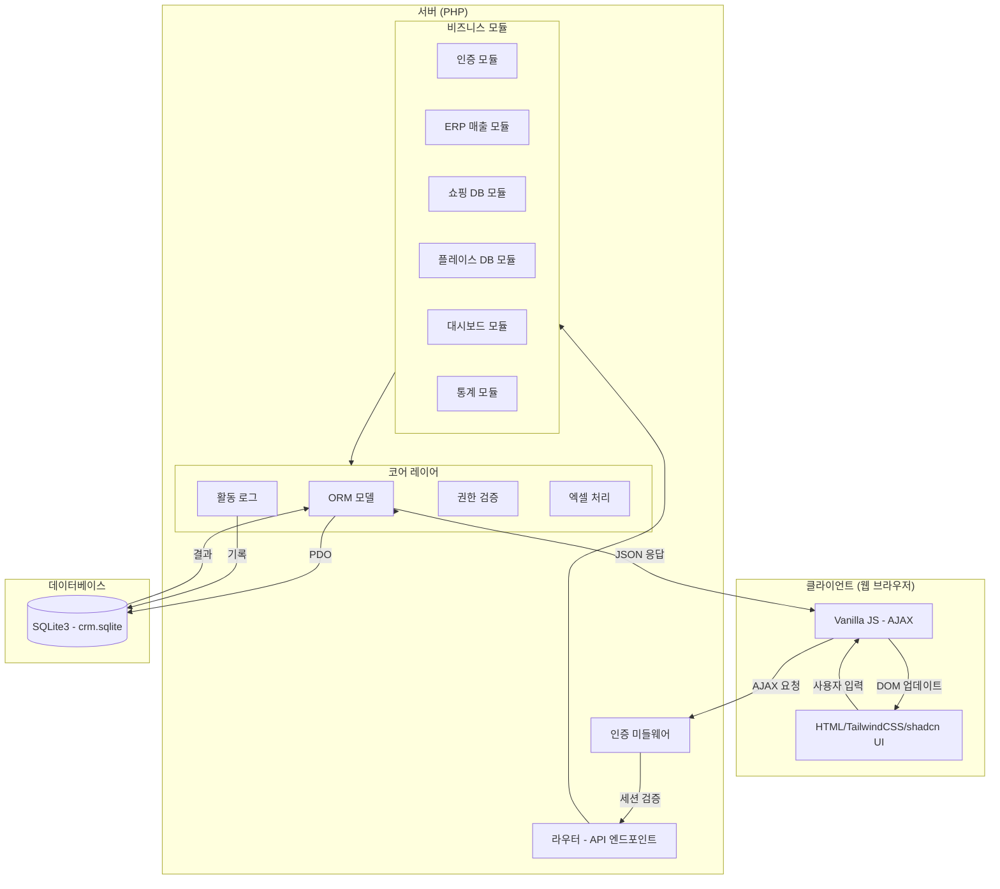
```mermaid
graph TB
    subgraph CLIENT["클라이언트 (웹 브라우저)"]
        UI[HTML/TailwindCSS/shadcn UI]
        JS[Vanilla JS - AJAX]
    end

    subgraph SERVER["서버 (PHP)"]
        AUTH[인증 미들웨어]
        ROUTER[라우터 - API 엔드포인트]

        subgraph MODULES["비즈니스 모듈"]
            M_AUTH[인증 모듈]
            M_ERP[ERP 매출 모듈]
            M_SHOP[쇼핑 DB 모듈]
            M_PLACE[플레이스 DB 모듈]
            M_DASH[대시보드 모듈]
            M_STAT[통계 모듈]
        end

        subgraph CORE["코어 레이어"]
            ORM[ORM 모델]
            LOG[활동 로그]
            PERM[권한 검증]
            EXCEL[엑셀 처리]
        end
    end

    subgraph DB["데이터베이스"]
        SQLITE[(SQLite3 - crm.sqlite)]
    end

    UI -->|사용자 입력| JS
    JS -->|AJAX 요청| AUTH
    AUTH -->|세션 검증| ROUTER
    ROUTER --> MODULES
    MODULES --> CORE
    CORE --> ORM
    ORM -->|PDO| SQLITE
    LOG -->|기록| SQLITE
    SQLITE -->|결과| ORM
    ORM -->|JSON 응답| JS
    JS -->|DOM 업데이트| UI
```

---

## 2. 사용자 인증 흐름도 (Authentication Flow)

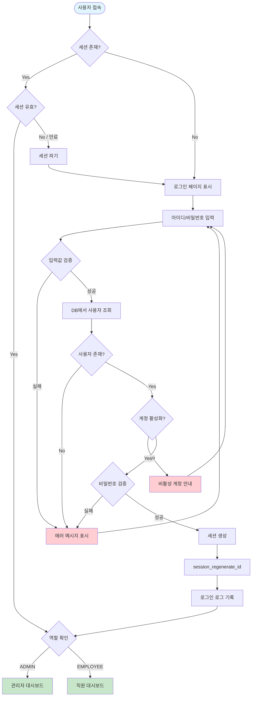
```mermaid
flowchart TD
    START([사용자 접속]) --> CHECK_SESSION{세션 존재?}

    CHECK_SESSION -->|Yes| VALIDATE_SESSION{세션 유효?}
    CHECK_SESSION -->|No| LOGIN_PAGE[로그인 페이지 표시]

    VALIDATE_SESSION -->|Yes| CHECK_ROLE{역할 확인}
    VALIDATE_SESSION -->|No / 만료| DESTROY_SESSION[세션 파기]
    DESTROY_SESSION --> LOGIN_PAGE

    LOGIN_PAGE --> INPUT_CRED[아이디/비밀번호 입력]
    INPUT_CRED --> VALIDATE_INPUT{입력값 검증}
    VALIDATE_INPUT -->|실패| ERROR_MSG[에러 메시지 표시]
    ERROR_MSG --> INPUT_CRED

    VALIDATE_INPUT -->|성공| QUERY_USER[DB에서 사용자 조회]
    QUERY_USER --> USER_EXISTS{사용자 존재?}
    USER_EXISTS -->|No| ERROR_MSG

    USER_EXISTS -->|Yes| CHECK_ACTIVE{계정 활성화?}
    CHECK_ACTIVE -->|No| ERROR_INACTIVE[비활성 계정 안내]
    ERROR_INACTIVE --> INPUT_CRED

    CHECK_ACTIVE -->|Yes| VERIFY_PW{비밀번호 검증}
    VERIFY_PW -->|실패| ERROR_MSG

    VERIFY_PW -->|성공| CREATE_SESSION[세션 생성]
    CREATE_SESSION --> REGENERATE[session_regenerate_id]
    REGENERATE --> LOG_LOGIN[로그인 로그 기록]
    LOG_LOGIN --> CHECK_ROLE

    CHECK_ROLE -->|ADMIN| ADMIN_DASH[관리자 대시보드]
    CHECK_ROLE -->|EMPLOYEE| EMP_DASH[직원 대시보드]

    style START fill:#e1f5fe
    style ADMIN_DASH fill:#c8e6c9
    style EMP_DASH fill:#c8e6c9
    style ERROR_MSG fill:#ffcdd2
    style ERROR_INACTIVE fill:#ffcdd2
```

---

## 3. ERP 매출 관리 흐름도

### 3.1 업체 등록 흐름

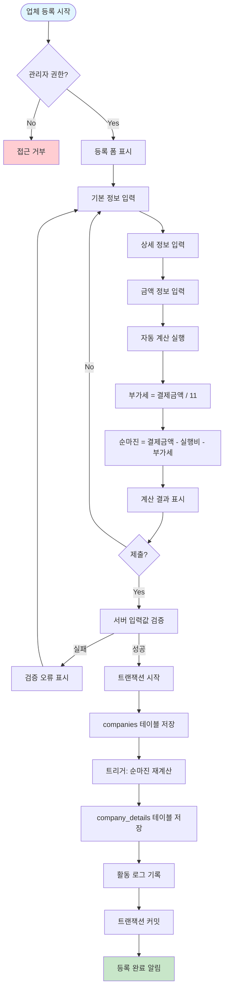
```mermaid
flowchart TD
    START([업체 등록 시작]) --> CHECK_PERM{관리자 권한?}
    CHECK_PERM -->|No| DENY[접근 거부]
    CHECK_PERM -->|Yes| SHOW_FORM[등록 폼 표시]

    SHOW_FORM --> INPUT_BASIC[기본 정보 입력]
    INPUT_BASIC --> INPUT_DETAIL[상세 정보 입력]
    INPUT_DETAIL --> INPUT_AMOUNT[금액 정보 입력]

    INPUT_AMOUNT --> AUTO_CALC[자동 계산 실행]
    AUTO_CALC --> CALC_VAT["부가세 = 결제금액 / 11"]
    CALC_VAT --> CALC_MARGIN["순마진 = 결제금액 - 실행비 - 부가세"]
    CALC_MARGIN --> DISPLAY_CALC[계산 결과 표시]

    DISPLAY_CALC --> SUBMIT{제출?}
    SUBMIT -->|No| INPUT_BASIC

    SUBMIT -->|Yes| VALIDATE[서버 입력값 검증]
    VALIDATE -->|실패| SHOW_ERROR[검증 오류 표시]
    SHOW_ERROR --> INPUT_BASIC

    VALIDATE -->|성공| BEGIN_TX[트랜잭션 시작]
    BEGIN_TX --> SAVE_COMPANY[companies 테이블 저장]
    SAVE_COMPANY --> TRIGGER_CALC[트리거: 순마진 재계산]
    TRIGGER_CALC --> SAVE_DETAIL[company_details 테이블 저장]
    SAVE_DETAIL --> LOG_ACTIVITY[활동 로그 기록]
    LOG_ACTIVITY --> COMMIT[트랜잭션 커밋]
    COMMIT --> SUCCESS[등록 완료 알림]

    style START fill:#e1f5fe
    style SUCCESS fill:#c8e6c9
    style DENY fill:#ffcdd2
```

### 3.2 계약 이월(연장) 흐름

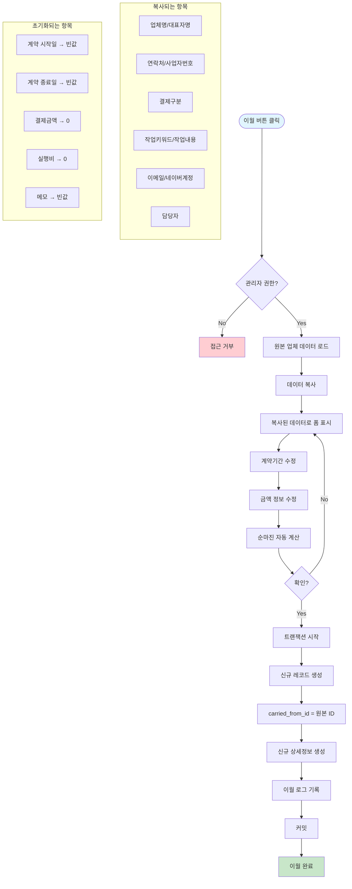
```mermaid
flowchart TD
    START([이월 버튼 클릭]) --> CHECK_PERM{관리자 권한?}
    CHECK_PERM -->|No| DENY[접근 거부]
    CHECK_PERM -->|Yes| LOAD_ORIGINAL[원본 업체 데이터 로드]

    LOAD_ORIGINAL --> COPY_DATA[데이터 복사]

    subgraph COPY["복사되는 항목"]
        C1[업체명/대표자명]
        C2[연락처/사업자번호]
        C3[결제구분]
        C4[작업키워드/작업내용]
        C5[이메일/네이버계정]
        C6[담당자]
    end

    subgraph INIT["초기화되는 항목"]
        I1[계약 시작일 → 빈값]
        I2[계약 종료일 → 빈값]
        I3[결제금액 → 0]
        I4[실행비 → 0]
        I5[메모 → 빈값]
    end

    COPY_DATA --> SHOW_FORM[복사된 데이터로 폼 표시]
    SHOW_FORM --> EDIT_PERIOD[계약기간 수정]
    EDIT_PERIOD --> EDIT_AMOUNT[금액 정보 수정]
    EDIT_AMOUNT --> AUTO_CALC[순마진 자동 계산]

    AUTO_CALC --> CONFIRM{확인?}
    CONFIRM -->|No| SHOW_FORM
    CONFIRM -->|Yes| BEGIN_TX[트랜잭션 시작]

    BEGIN_TX --> SAVE_NEW[신규 레코드 생성]
    SAVE_NEW --> SET_CARRY_REF["carried_from_id = 원본 ID"]
    SET_CARRY_REF --> SAVE_NEW_DETAIL[신규 상세정보 생성]
    SAVE_NEW_DETAIL --> LOG_CARRYOVER[이월 로그 기록]
    LOG_CARRYOVER --> COMMIT[커밋]
    COMMIT --> SUCCESS[이월 완료]

    style START fill:#e1f5fe
    style SUCCESS fill:#c8e6c9
    style DENY fill:#ffcdd2
```

---

## 4. CRM 네이버 쇼핑 DB 흐름도

### 4.1 엑셀 업로드 흐름

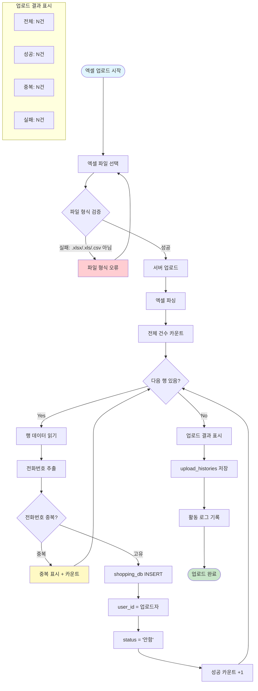
```mermaid
flowchart TD
    START([엑셀 업로드 시작]) --> SELECT_FILE[엑셀 파일 선택]
    SELECT_FILE --> CHECK_FORMAT{파일 형식 검증}

    CHECK_FORMAT -->|실패: .xlsx/.xls/.csv 아님| ERROR_FORMAT[파일 형식 오류]
    ERROR_FORMAT --> SELECT_FILE

    CHECK_FORMAT -->|성공| UPLOAD[서버 업로드]
    UPLOAD --> PARSE[엑셀 파싱]
    PARSE --> COUNT_TOTAL["전체 건수 카운트"]

    COUNT_TOTAL --> LOOP_START{다음 행 있음?}
    LOOP_START -->|No| SHOW_RESULT[업로드 결과 표시]

    LOOP_START -->|Yes| READ_ROW[행 데이터 읽기]
    READ_ROW --> EXTRACT_PHONE[전화번호 추출]
    EXTRACT_PHONE --> CHECK_DUP{전화번호 중복?}

    CHECK_DUP -->|중복| MARK_DUP[중복 표시 + 카운트]
    MARK_DUP --> LOOP_START

    CHECK_DUP -->|고유| INSERT_DB[shopping_db INSERT]
    INSERT_DB --> SET_USER["user_id = 업로드자"]
    SET_USER --> SET_STATUS["status = '안함'"]
    SET_STATUS --> INC_SUCCESS[성공 카운트 +1]
    INC_SUCCESS --> LOOP_START

    SHOW_RESULT --> SAVE_HISTORY[upload_histories 저장]
    SAVE_HISTORY --> LOG_ACTIVITY[활동 로그 기록]
    LOG_ACTIVITY --> DONE([업로드 완료])

    subgraph RESULT["업로드 결과 표시"]
        R1["전체: N건"]
        R2["성공: N건"]
        R3["중복: N건"]
        R4["실패: N건"]
    end

    style START fill:#e1f5fe
    style DONE fill:#c8e6c9
    style ERROR_FORMAT fill:#ffcdd2
    style MARK_DUP fill:#fff9c4
```

### 4.2 DB 배분/회수 흐름

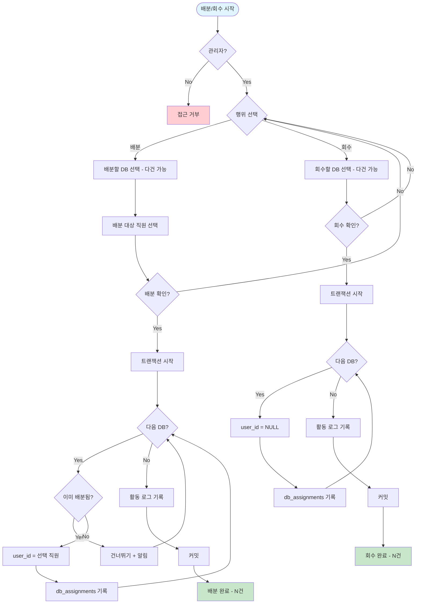
```mermaid
flowchart TD
    START([배분/회수 시작]) --> CHECK_ADMIN{관리자?}
    CHECK_ADMIN -->|No| DENY[접근 거부]
    CHECK_ADMIN -->|Yes| SELECT_ACTION{행위 선택}

    SELECT_ACTION -->|배분| SELECT_DB_ASSIGN[배분할 DB 선택 - 다건 가능]
    SELECT_DB_ASSIGN --> SELECT_EMPLOYEE[배분 대상 직원 선택]
    SELECT_EMPLOYEE --> CONFIRM_ASSIGN{배분 확인?}

    CONFIRM_ASSIGN -->|No| SELECT_ACTION
    CONFIRM_ASSIGN -->|Yes| BEGIN_TX_A[트랜잭션 시작]

    BEGIN_TX_A --> LOOP_A{다음 DB?}
    LOOP_A -->|Yes| CHECK_ALREADY{이미 배분됨?}
    CHECK_ALREADY -->|Yes| SKIP_A[건너뛰기 + 알림]
    SKIP_A --> LOOP_A
    CHECK_ALREADY -->|No| UPDATE_USER_A["user_id = 선택 직원"]
    UPDATE_USER_A --> SAVE_ASSIGN_A[db_assignments 기록]
    SAVE_ASSIGN_A --> LOOP_A
    LOOP_A -->|No| LOG_A[활동 로그 기록]
    LOG_A --> COMMIT_A[커밋]
    COMMIT_A --> RESULT_A[배분 완료 - N건]

    SELECT_ACTION -->|회수| SELECT_DB_REVOKE[회수할 DB 선택 - 다건 가능]
    SELECT_DB_REVOKE --> CONFIRM_REVOKE{회수 확인?}

    CONFIRM_REVOKE -->|No| SELECT_ACTION
    CONFIRM_REVOKE -->|Yes| BEGIN_TX_R[트랜잭션 시작]

    BEGIN_TX_R --> LOOP_R{다음 DB?}
    LOOP_R -->|Yes| UPDATE_USER_R["user_id = NULL"]
    UPDATE_USER_R --> SAVE_ASSIGN_R[db_assignments 기록]
    SAVE_ASSIGN_R --> LOOP_R
    LOOP_R -->|No| LOG_R[활동 로그 기록]
    LOG_R --> COMMIT_R[커밋]
    COMMIT_R --> RESULT_R[회수 완료 - N건]

    style START fill:#e1f5fe
    style RESULT_A fill:#c8e6c9
    style RESULT_R fill:#c8e6c9
    style DENY fill:#ffcdd2
```

### 4.3 콜 처리 (상태 변경) 흐름

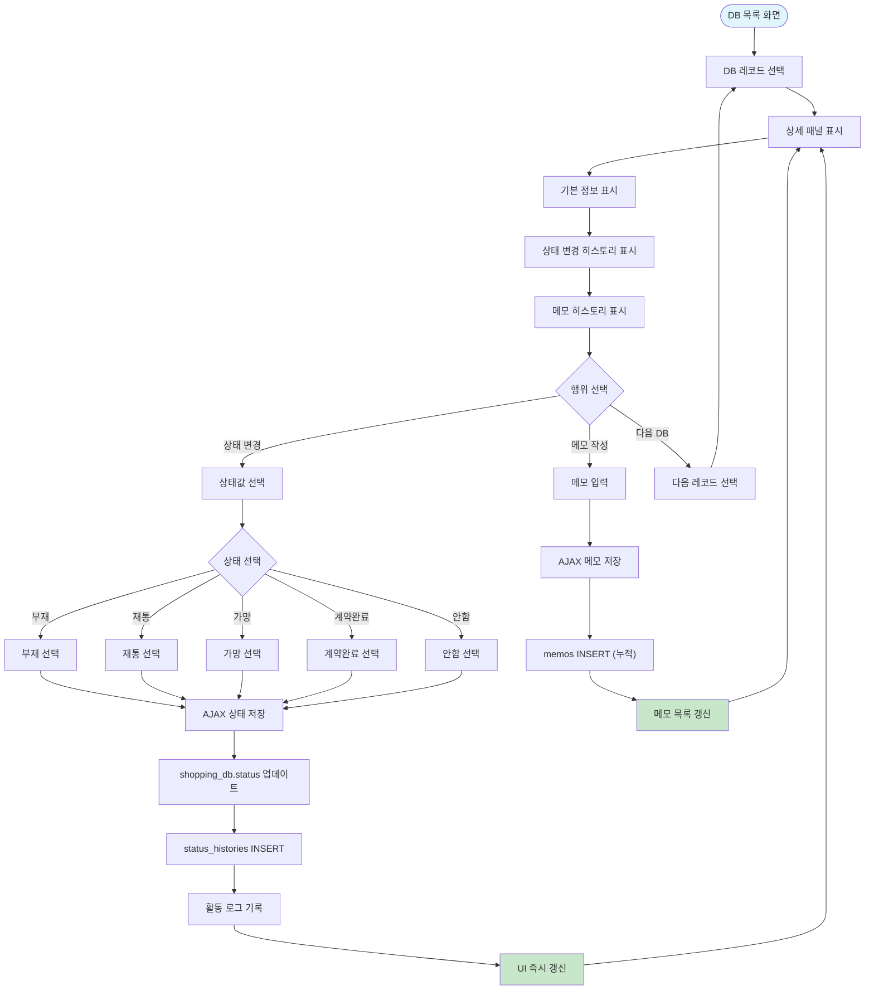
```mermaid
flowchart TD
    START([DB 목록 화면]) --> SELECT_DB[DB 레코드 선택]
    SELECT_DB --> SHOW_DETAIL[상세 패널 표시]

    SHOW_DETAIL --> SHOW_INFO[기본 정보 표시]
    SHOW_INFO --> SHOW_HISTORY[상태 변경 히스토리 표시]
    SHOW_HISTORY --> SHOW_MEMOS[메모 히스토리 표시]

    SHOW_MEMOS --> ACTION{행위 선택}

    ACTION -->|상태 변경| SELECT_STATUS[상태값 선택]
    SELECT_STATUS --> STATUS_OPTIONS{상태 선택}

    STATUS_OPTIONS -->|부재| S1["부재 선택"]
    STATUS_OPTIONS -->|재통| S2["재통 선택"]
    STATUS_OPTIONS -->|가망| S3["가망 선택"]
    STATUS_OPTIONS -->|계약완료| S4["계약완료 선택"]
    STATUS_OPTIONS -->|안함| S5["안함 선택"]

    S1 & S2 & S3 & S4 & S5 --> SAVE_STATUS[AJAX 상태 저장]
    SAVE_STATUS --> UPDATE_DB["shopping_db.status 업데이트"]
    UPDATE_DB --> RECORD_HISTORY["status_histories INSERT"]
    RECORD_HISTORY --> LOG_STATUS[활동 로그 기록]
    LOG_STATUS --> REFRESH_UI[UI 즉시 갱신]
    REFRESH_UI --> SHOW_DETAIL

    ACTION -->|메모 작성| INPUT_MEMO[메모 입력]
    INPUT_MEMO --> SAVE_MEMO[AJAX 메모 저장]
    SAVE_MEMO --> INSERT_MEMO["memos INSERT (누적)"]
    INSERT_MEMO --> REFRESH_MEMOS[메모 목록 갱신]
    REFRESH_MEMOS --> SHOW_DETAIL

    ACTION -->|다음 DB| NEXT_DB[다음 레코드 선택]
    NEXT_DB --> SELECT_DB

    style START fill:#e1f5fe
    style REFRESH_UI fill:#c8e6c9
    style REFRESH_MEMOS fill:#c8e6c9
```

---

## 5. CRM 네이버 플레이스 DB 흐름도

### 5.1 플레이스 DB 등록 흐름

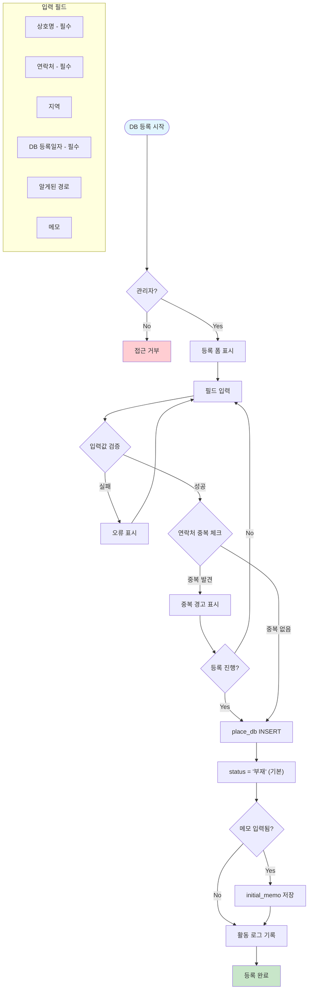
```mermaid
flowchart TD
    START([DB 등록 시작]) --> CHECK_ADMIN{관리자?}
    CHECK_ADMIN -->|No| DENY[접근 거부]
    CHECK_ADMIN -->|Yes| SHOW_FORM[등록 폼 표시]

    SHOW_FORM --> INPUT[필드 입력]

    subgraph FIELDS["입력 필드"]
        F1[상호명 - 필수]
        F2[연락처 - 필수]
        F3[지역]
        F4[DB 등록일자 - 필수]
        F5[알게된 경로]
        F6[메모]
    end

    INPUT --> VALIDATE{입력값 검증}
    VALIDATE -->|실패| SHOW_ERROR[오류 표시]
    SHOW_ERROR --> INPUT

    VALIDATE -->|성공| CHECK_DUP{연락처 중복 체크}
    CHECK_DUP -->|중복 발견| WARN_DUP[중복 경고 표시]
    WARN_DUP --> DECIDE{등록 진행?}
    DECIDE -->|No| INPUT
    DECIDE -->|Yes| SAVE

    CHECK_DUP -->|중복 없음| SAVE[place_db INSERT]
    SAVE --> SET_STATUS["status = '부재' (기본)"]
    SET_STATUS --> SAVE_MEMO{메모 입력됨?}
    SAVE_MEMO -->|Yes| INSERT_MEMO["initial_memo 저장"]
    SAVE_MEMO -->|No| LOG
    INSERT_MEMO --> LOG[활동 로그 기록]
    LOG --> SUCCESS[등록 완료]

    style START fill:#e1f5fe
    style SUCCESS fill:#c8e6c9
    style DENY fill:#ffcdd2
```

### 5.2 플레이스 DB 상태 변경 흐름

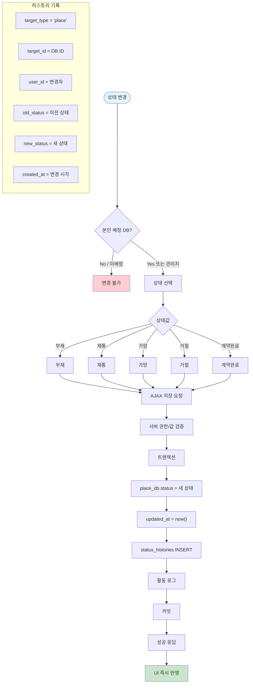
```mermaid
flowchart TD
    START([상태 변경]) --> CHECK_PERM{본인 배정 DB?}
    CHECK_PERM -->|No / 미배정| DENY[변경 불가]
    CHECK_PERM -->|Yes 또는 관리자| SELECT_STATUS[상태 선택]

    SELECT_STATUS --> STATUS_OPTIONS{상태값}
    STATUS_OPTIONS -->|부재| S1[부재]
    STATUS_OPTIONS -->|재통| S2[재통]
    STATUS_OPTIONS -->|가망| S3[가망]
    STATUS_OPTIONS -->|거절| S4[거절]
    STATUS_OPTIONS -->|계약완료| S5[계약완료]

    S1 & S2 & S3 & S4 & S5 --> AJAX_SAVE[AJAX 저장 요청]

    AJAX_SAVE --> SERVER_VALIDATE[서버 권한/값 검증]
    SERVER_VALIDATE --> BEGIN_TX[트랜잭션]
    BEGIN_TX --> UPDATE_STATUS["place_db.status = 새 상태"]
    UPDATE_STATUS --> UPDATE_TIME["updated_at = now()"]
    UPDATE_TIME --> INSERT_HISTORY["status_histories INSERT"]

    subgraph HISTORY_RECORD["히스토리 기록"]
        H1["target_type = 'place'"]
        H2["target_id = DB ID"]
        H3["user_id = 변경자"]
        H4["old_status = 이전 상태"]
        H5["new_status = 새 상태"]
        H6["created_at = 변경 시각"]
    end

    INSERT_HISTORY --> LOG_ACTIVITY[활동 로그]
    LOG_ACTIVITY --> COMMIT[커밋]
    COMMIT --> RESPONSE_OK[성공 응답]
    RESPONSE_OK --> UI_UPDATE[UI 즉시 반영]

    style START fill:#e1f5fe
    style UI_UPDATE fill:#c8e6c9
    style DENY fill:#ffcdd2
```

---

## 6. 대시보드 데이터 흐름도

### 6.1 관리자 대시보드

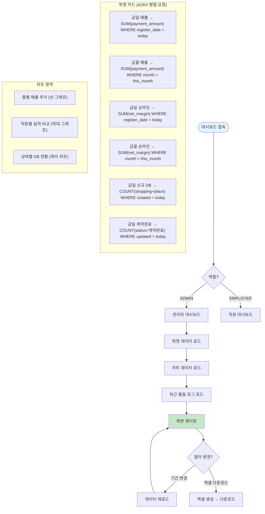
```mermaid
flowchart TD
    START([대시보드 접속]) --> CHECK_ROLE{역할?}

    CHECK_ROLE -->|ADMIN| ADMIN_DASH[관리자 대시보드]
    CHECK_ROLE -->|EMPLOYEE| EMP_DASH[직원 대시보드]

    ADMIN_DASH --> LOAD_WIDGETS[위젯 데이터 로드]

    subgraph WIDGETS["위젯 카드 (AJAX 병렬 요청)"]
        W1["금일 매출 → SUM(payment_amount) WHERE register_date = today"]
        W2["금월 매출 → SUM(payment_amount) WHERE month = this_month"]
        W3["금일 순마진 → SUM(net_margin) WHERE register_date = today"]
        W4["금월 순마진 → SUM(net_margin) WHERE month = this_month"]
        W5["금일 신규 DB → COUNT(shopping+place) WHERE created = today"]
        W6["금일 계약완료 → COUNT(status=계약완료) WHERE updated = today"]
    end

    LOAD_WIDGETS --> LOAD_CHARTS[차트 데이터 로드]

    subgraph CHARTS["차트 영역"]
        C1["월별 매출 추이 (선 그래프)"]
        C2["직원별 실적 비교 (막대 그래프)"]
        C3["상태별 DB 현황 (파이 차트)"]
    end

    LOAD_CHARTS --> LOAD_LOGS[최근 활동 로그 로드]
    LOAD_LOGS --> RENDER[화면 렌더링]

    RENDER --> FILTER_ACTION{필터 변경?}
    FILTER_ACTION -->|기간 변경| RELOAD_DATA[데이터 재로드]
    RELOAD_DATA --> RENDER

    FILTER_ACTION -->|엑셀 다운로드| EXPORT_EXCEL[엑셀 생성 → 다운로드]

    style START fill:#e1f5fe
    style RENDER fill:#c8e6c9
```

### 6.2 직원 대시보드

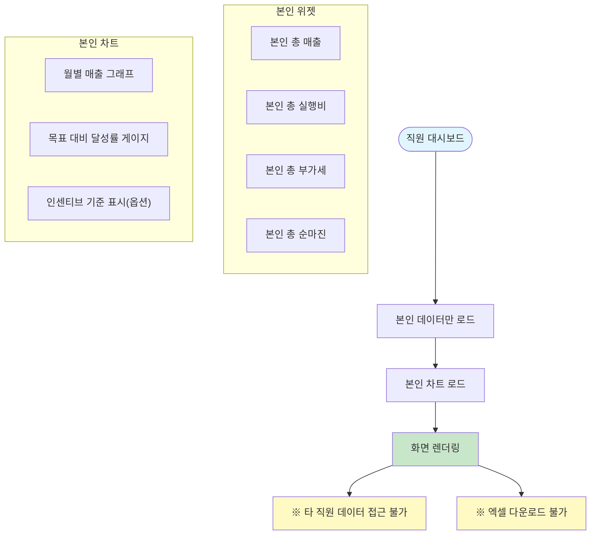
```mermaid
flowchart TD
    START([직원 대시보드]) --> LOAD_MY_DATA[본인 데이터만 로드]

    subgraph MY_WIDGETS["본인 위젯"]
        MW1["본인 총 매출"]
        MW2["본인 총 실행비"]
        MW3["본인 총 부가세"]
        MW4["본인 총 순마진"]
    end

    LOAD_MY_DATA --> LOAD_MY_CHART[본인 차트 로드]

    subgraph MY_CHARTS["본인 차트"]
        MC1["월별 매출 그래프"]
        MC2["목표 대비 달성률 게이지"]
        MC3["인센티브 기준 표시(옵션)"]
    end

    LOAD_MY_CHART --> RENDER[화면 렌더링]

    RENDER --> NOTE["※ 타 직원 데이터 접근 불가"]
    RENDER --> NOTE2["※ 엑셀 다운로드 불가"]

    style START fill:#e1f5fe
    style RENDER fill:#c8e6c9
    style NOTE fill:#fff9c4
    style NOTE2 fill:#fff9c4
```

---

## 7. 메모 시스템 흐름도 (공통)

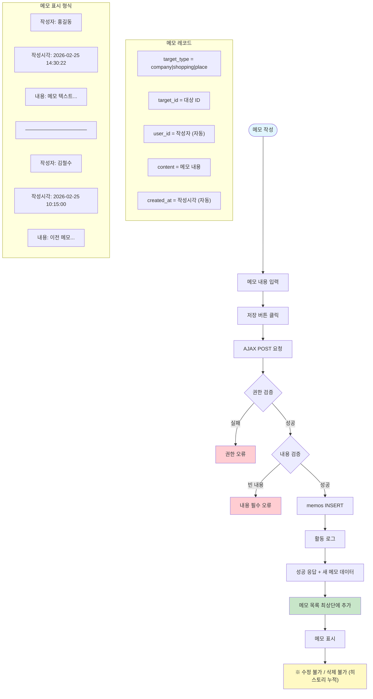
```mermaid
flowchart TD
    START([메모 작성]) --> INPUT[메모 내용 입력]
    INPUT --> SUBMIT[저장 버튼 클릭]

    SUBMIT --> AJAX[AJAX POST 요청]
    AJAX --> SERVER_CHECK{권한 검증}
    SERVER_CHECK -->|실패| ERROR[권한 오류]
    SERVER_CHECK -->|성공| VALIDATE{내용 검증}

    VALIDATE -->|빈 내용| ERROR_EMPTY[내용 필수 오류]
    VALIDATE -->|성공| INSERT_MEMO[memos INSERT]

    subgraph MEMO_RECORD["메모 레코드"]
        M1["target_type = company|shopping|place"]
        M2["target_id = 대상 ID"]
        M3["user_id = 작성자 (자동)"]
        M4["content = 메모 내용"]
        M5["created_at = 작성시각 (자동)"]
    end

    INSERT_MEMO --> LOG[활동 로그]
    LOG --> RESPONSE[성공 응답 + 새 메모 데이터]
    RESPONSE --> PREPEND_UI[메모 목록 최상단에 추가]

    PREPEND_UI --> DISPLAY[메모 표시]

    subgraph DISPLAY_FORMAT["메모 표시 형식"]
        D1["작성자: 홍길동"]
        D2["작성시각: 2026-02-25 14:30:22"]
        D3["내용: 메모 텍스트..."]
        D4["─────────────────"]
        D5["작성자: 김철수"]
        D6["작성시각: 2026-02-25 10:15:00"]
        D7["내용: 이전 메모..."]
    end

    DISPLAY --> NOTE["※ 수정 불가 / 삭제 불가 (히스토리 누적)"]

    style START fill:#e1f5fe
    style PREPEND_UI fill:#c8e6c9
    style NOTE fill:#fff9c4
    style ERROR fill:#ffcdd2
    style ERROR_EMPTY fill:#ffcdd2
```

---

## 8. 엑셀 다운로드 흐름도

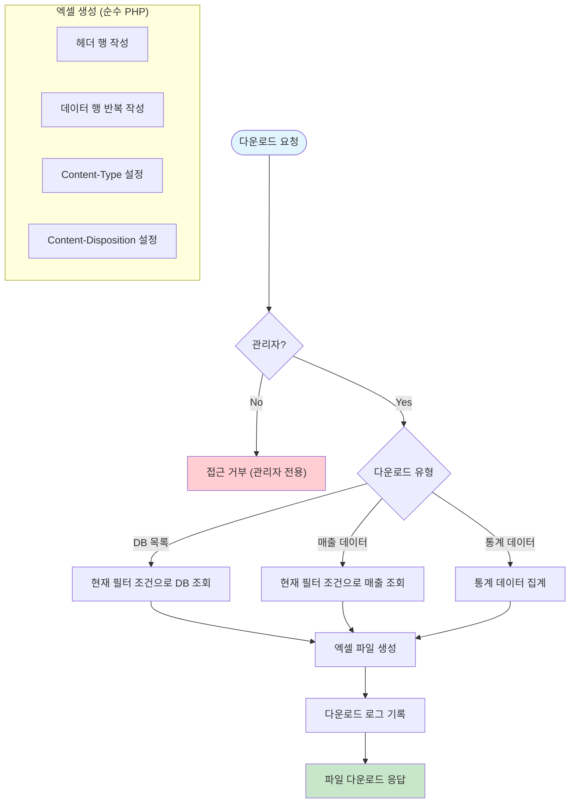
```mermaid
flowchart TD
    START([다운로드 요청]) --> CHECK_ADMIN{관리자?}
    CHECK_ADMIN -->|No| DENY["접근 거부 (관리자 전용)"]
    CHECK_ADMIN -->|Yes| SELECT_TYPE{다운로드 유형}

    SELECT_TYPE -->|DB 목록| QUERY_DB[현재 필터 조건으로 DB 조회]
    SELECT_TYPE -->|매출 데이터| QUERY_SALES[현재 필터 조건으로 매출 조회]
    SELECT_TYPE -->|통계 데이터| QUERY_STATS[통계 데이터 집계]

    QUERY_DB & QUERY_SALES & QUERY_STATS --> BUILD_EXCEL[엑셀 파일 생성]

    subgraph EXCEL_BUILD["엑셀 생성 (순수 PHP)"]
        E1["헤더 행 작성"]
        E2["데이터 행 반복 작성"]
        E3["Content-Type 설정"]
        E4["Content-Disposition 설정"]
    end

    BUILD_EXCEL --> LOG[다운로드 로그 기록]
    LOG --> DOWNLOAD[파일 다운로드 응답]

    style START fill:#e1f5fe
    style DOWNLOAD fill:#c8e6c9
    style DENY fill:#ffcdd2
```

---

## 9. 상태 전이도 (State Transition Diagram)

### 9.1 네이버 쇼핑 DB 상태 전이

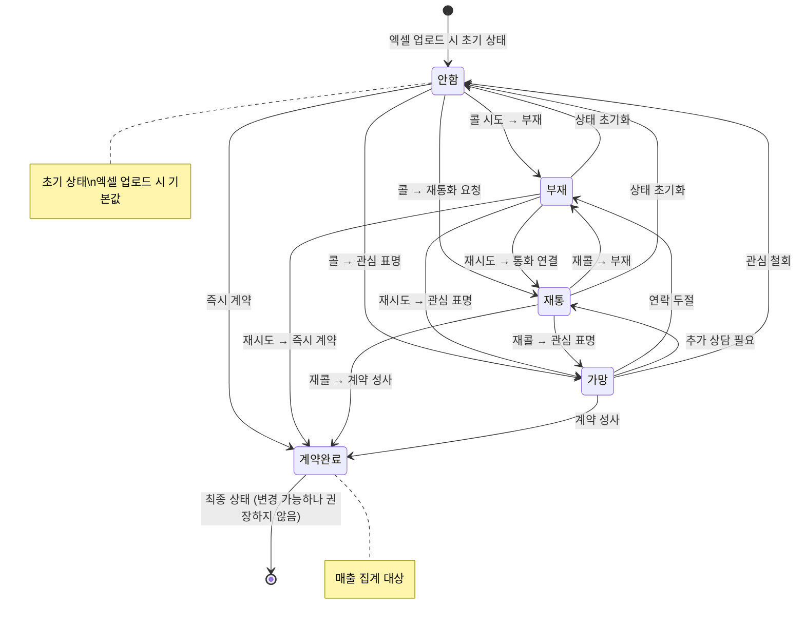
```mermaid
stateDiagram-v2
    [*] --> 안함 : 엑셀 업로드 시 초기 상태

    안함 --> 부재 : 콜 시도 → 부재
    안함 --> 재통 : 콜 → 재통화 요청
    안함 --> 가망 : 콜 → 관심 표명
    안함 --> 계약완료 : 즉시 계약

    부재 --> 재통 : 재시도 → 통화 연결
    부재 --> 가망 : 재시도 → 관심 표명
    부재 --> 계약완료 : 재시도 → 즉시 계약
    부재 --> 안함 : 상태 초기화

    재통 --> 부재 : 재콜 → 부재
    재통 --> 가망 : 재콜 → 관심 표명
    재통 --> 계약완료 : 재콜 → 계약 성사
    재통 --> 안함 : 상태 초기화

    가망 --> 계약완료 : 계약 성사
    가망 --> 부재 : 연락 두절
    가망 --> 재통 : 추가 상담 필요
    가망 --> 안함 : 관심 철회

    계약완료 --> [*] : 최종 상태 (변경 가능하나 권장하지 않음)

    note right of 안함 : 초기 상태\n엑셀 업로드 시 기본값
    note right of 계약완료 : 매출 집계 대상
```

### 9.2 네이버 플레이스 DB 상태 전이

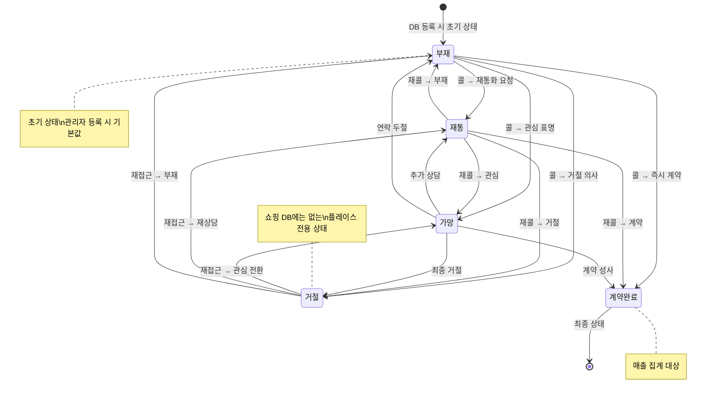
```mermaid
stateDiagram-v2
    [*] --> 부재 : DB 등록 시 초기 상태

    부재 --> 재통 : 콜 → 재통화 요청
    부재 --> 가망 : 콜 → 관심 표명
    부재 --> 거절 : 콜 → 거절 의사
    부재 --> 계약완료 : 콜 → 즉시 계약

    재통 --> 부재 : 재콜 → 부재
    재통 --> 가망 : 재콜 → 관심
    재통 --> 거절 : 재콜 → 거절
    재통 --> 계약완료 : 재콜 → 계약

    가망 --> 계약완료 : 계약 성사
    가망 --> 거절 : 최종 거절
    가망 --> 재통 : 추가 상담
    가망 --> 부재 : 연락 두절

    거절 --> 가망 : 재접근 → 관심 전환
    거절 --> 재통 : 재접근 → 재상담
    거절 --> 부재 : 재접근 → 부재

    계약완료 --> [*] : 최종 상태

    note right of 부재 : 초기 상태\n관리자 등록 시 기본값
    note left of 거절 : 쇼핑 DB에는 없는\n플레이스 전용 상태
    note right of 계약완료 : 매출 집계 대상
```

---

## 10. 직원 계정 생명주기

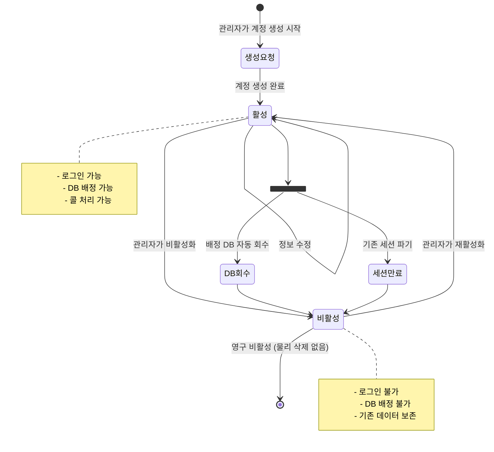
```mermaid
stateDiagram-v2
    [*] --> 생성요청 : 관리자가 계정 생성 시작

    생성요청 --> 활성 : 계정 생성 완료
    활성 --> 활성 : 정보 수정
    활성 --> 비활성 : 관리자가 비활성화

    state 비활성화처리 <<fork>>
    활성 --> 비활성화처리
    비활성화처리 --> DB회수 : 배정 DB 자동 회수
    비활성화처리 --> 세션만료 : 기존 세션 파기

    DB회수 --> 비활성
    세션만료 --> 비활성

    비활성 --> 활성 : 관리자가 재활성화
    비활성 --> [*] : 영구 비활성 (물리 삭제 없음)

    note right of 활성
        - 로그인 가능
        - DB 배정 가능
        - 콜 처리 가능
    end note

    note right of 비활성
        - 로그인 불가
        - DB 배정 불가
        - 기존 데이터 보존
    end note
```

---

## 11. 데이터 흐름도 (DFD Level 0)

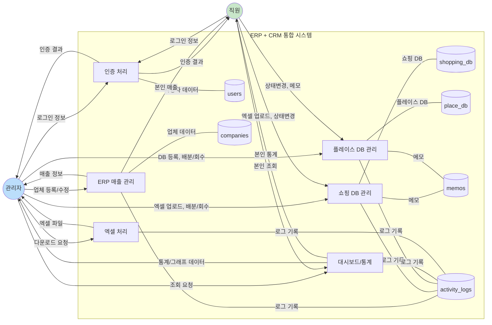
```mermaid
flowchart LR
    ADMIN((관리자))
    EMP((직원))

    subgraph SYSTEM["ERP + CRM 통합 시스템"]
        P1[인증 처리]
        P2[ERP 매출 관리]
        P3[쇼핑 DB 관리]
        P4[플레이스 DB 관리]
        P5[대시보드/통계]
        P6[엑셀 처리]

        DS1[(users)]
        DS2[(companies)]
        DS3[(shopping_db)]
        DS4[(place_db)]
        DS5[(memos)]
        DS6[(activity_logs)]
    end

    ADMIN -->|로그인 정보| P1
    EMP -->|로그인 정보| P1
    P1 -->|인증 결과| ADMIN
    P1 -->|인증 결과| EMP
    P1 ---|사용자 데이터| DS1

    ADMIN -->|업체 등록/수정| P2
    P2 ---|업체 데이터| DS2
    P2 -->|매출 정보| ADMIN
    P2 -->|본인 매출| EMP

    ADMIN -->|엑셀 업로드, 배분/회수| P3
    EMP -->|엑셀 업로드, 상태변경| P3
    P3 ---|쇼핑 DB| DS3
    P3 ---|메모| DS5

    ADMIN -->|DB 등록, 배분/회수| P4
    EMP -->|상태변경, 메모| P4
    P4 ---|플레이스 DB| DS4
    P4 ---|메모| DS5

    ADMIN -->|조회 요청| P5
    EMP -->|본인 조회| P5
    P5 -->|통계/그래프 데이터| ADMIN
    P5 -->|본인 통계| EMP

    ADMIN -->|다운로드 요청| P6
    P6 -->|엑셀 파일| ADMIN

    P2 & P3 & P4 & P5 & P6 ---|로그 기록| DS6

    style ADMIN fill:#bbdefb
    style EMP fill:#c8e6c9
```

---

## 12. AJAX 통신 흐름 (실시간 저장)

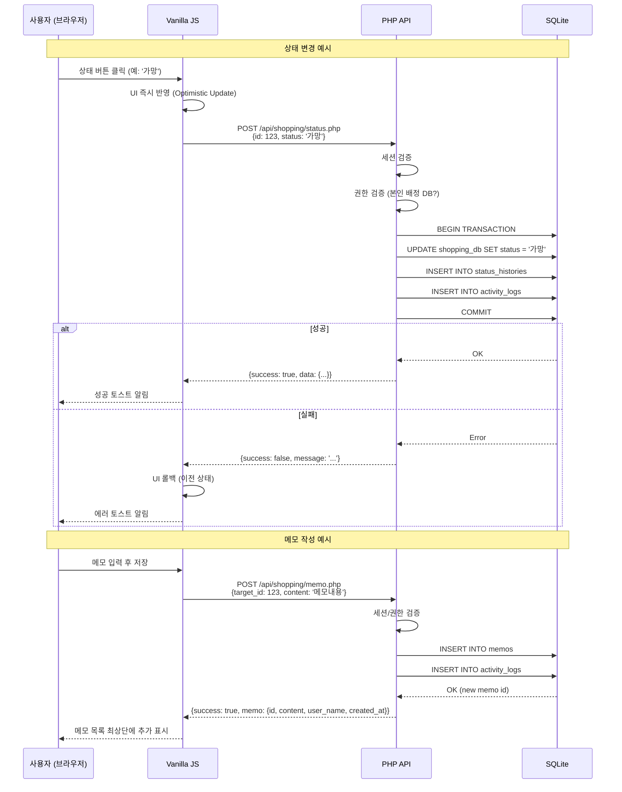
```mermaid
sequenceDiagram
    participant U as 사용자 (브라우저)
    participant JS as Vanilla JS
    participant API as PHP API
    participant DB as SQLite

    Note over U,DB: 상태 변경 예시

    U->>JS: 상태 버튼 클릭 (예: '가망')
    JS->>JS: UI 즉시 반영 (Optimistic Update)
    JS->>API: POST /api/shopping/status.php<br/>{id: 123, status: '가망'}

    API->>API: 세션 검증
    API->>API: 권한 검증 (본인 배정 DB?)
    API->>DB: BEGIN TRANSACTION
    API->>DB: UPDATE shopping_db SET status = '가망'
    API->>DB: INSERT INTO status_histories
    API->>DB: INSERT INTO activity_logs
    API->>DB: COMMIT

    alt 성공
        DB-->>API: OK
        API-->>JS: {success: true, data: {...}}
        JS-->>U: 성공 토스트 알림
    else 실패
        DB-->>API: Error
        API-->>JS: {success: false, message: '...'}
        JS->>JS: UI 롤백 (이전 상태)
        JS-->>U: 에러 토스트 알림
    end

    Note over U,DB: 메모 작성 예시

    U->>JS: 메모 입력 후 저장
    JS->>API: POST /api/shopping/memo.php<br/>{target_id: 123, content: '메모내용'}

    API->>API: 세션/권한 검증
    API->>DB: INSERT INTO memos
    API->>DB: INSERT INTO activity_logs
    DB-->>API: OK (new memo id)
    API-->>JS: {success: true, memo: {id, content, user_name, created_at}}
    JS-->>U: 메모 목록 최상단에 추가 표시
```

---

## 13. 페이지 네비게이션 흐름

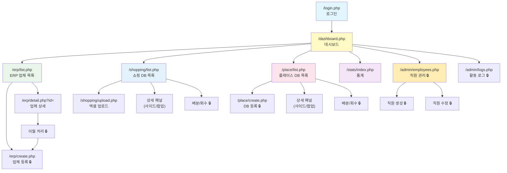
```mermaid
flowchart TD
    LOGIN["/login.php<br/>로그인"] --> DASH["/dashboard.php<br/>대시보드"]

    DASH --> ERP_LIST["/erp/list.php<br/>ERP 업체 목록"]
    DASH --> SHOP_LIST["/shopping/list.php<br/>쇼핑 DB 목록"]
    DASH --> PLACE_LIST["/place/list.php<br/>플레이스 DB 목록"]
    DASH --> STATS["/stats/index.php<br/>통계"]
    DASH --> ADMIN_EMP["/admin/employees.php<br/>직원 관리 🔒"]

    ERP_LIST --> ERP_CREATE["/erp/create.php<br/>업체 등록 🔒"]
    ERP_LIST --> ERP_DETAIL["/erp/detail.php?id=<br/>업체 상세"]
    ERP_DETAIL --> ERP_CARRY["이월 처리 🔒"]
    ERP_CARRY --> ERP_CREATE

    SHOP_LIST --> SHOP_UPLOAD["/shopping/upload.php<br/>엑셀 업로드"]
    SHOP_LIST --> SHOP_DETAIL["상세 패널<br/>(사이드/팝업)"]
    SHOP_LIST --> SHOP_ASSIGN["배분/회수 🔒"]

    PLACE_LIST --> PLACE_CREATE["/place/create.php<br/>DB 등록 🔒"]
    PLACE_LIST --> PLACE_DETAIL["상세 패널<br/>(사이드/팝업)"]
    PLACE_LIST --> PLACE_ASSIGN["배분/회수 🔒"]

    ADMIN_EMP --> ADMIN_CREATE["직원 생성 🔒"]
    ADMIN_EMP --> ADMIN_EDIT["직원 수정 🔒"]

    DASH --> ADMIN_LOGS["/admin/logs.php<br/>활동 로그 🔒"]

    style LOGIN fill:#e1f5fe
    style DASH fill:#fff9c4
    style ERP_LIST fill:#e8f5e9
    style SHOP_LIST fill:#e3f2fd
    style PLACE_LIST fill:#fce4ec
    style STATS fill:#f3e5f5
    style ADMIN_EMP fill:#ffecb3
```

> 🔒 = 관리자 전용 페이지/기능

---

## 14. 권한 검증 흐름 (모든 API 공통)

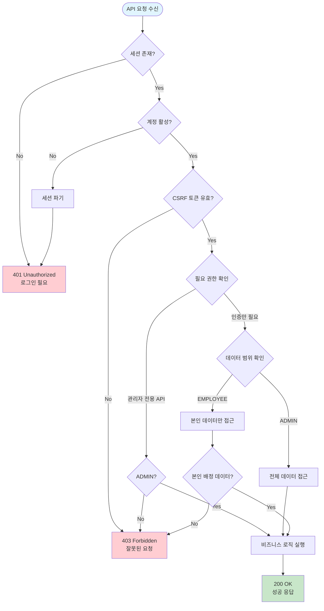
```mermaid
flowchart TD
    REQUEST([API 요청 수신]) --> CHECK_SESSION{세션 존재?}
    CHECK_SESSION -->|No| RETURN_401["401 Unauthorized<br/>로그인 필요"]

    CHECK_SESSION -->|Yes| CHECK_ACTIVE{계정 활성?}
    CHECK_ACTIVE -->|No| DESTROY[세션 파기]
    DESTROY --> RETURN_401

    CHECK_ACTIVE -->|Yes| CHECK_CSRF{CSRF 토큰 유효?}
    CHECK_CSRF -->|No| RETURN_403["403 Forbidden<br/>잘못된 요청"]

    CHECK_CSRF -->|Yes| CHECK_PERM{필요 권한 확인}

    CHECK_PERM -->|관리자 전용 API| IS_ADMIN{ADMIN?}
    IS_ADMIN -->|No| RETURN_403
    IS_ADMIN -->|Yes| PROCESS[비즈니스 로직 실행]

    CHECK_PERM -->|인증만 필요| CHECK_SCOPE{데이터 범위 확인}
    CHECK_SCOPE -->|ADMIN| ALL_DATA[전체 데이터 접근]
    CHECK_SCOPE -->|EMPLOYEE| OWN_DATA[본인 데이터만 접근]

    ALL_DATA --> PROCESS
    OWN_DATA --> CHECK_OWNER{본인 배정 데이터?}
    CHECK_OWNER -->|No| RETURN_403
    CHECK_OWNER -->|Yes| PROCESS

    PROCESS --> RETURN_200["200 OK<br/>성공 응답"]

    style REQUEST fill:#e1f5fe
    style RETURN_200 fill:#c8e6c9
    style RETURN_401 fill:#ffcdd2
    style RETURN_403 fill:#ffcdd2
```
